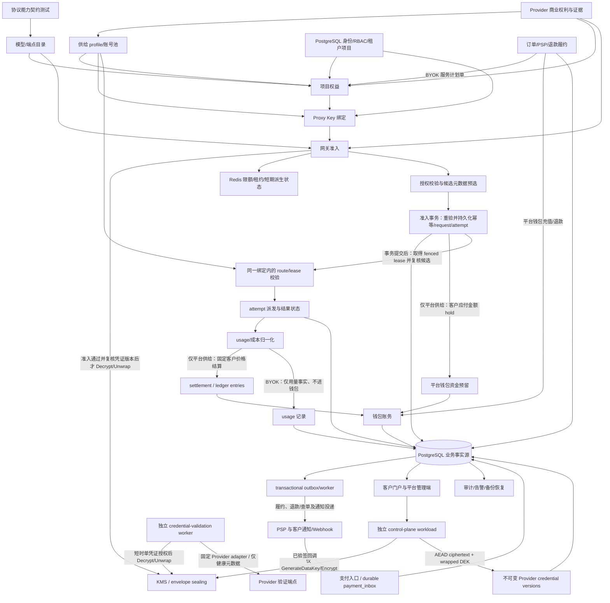

# Sub2API 商业平台能力融入 model-router 技术方案

日期：2026-09-29

状态：产品与工程实施方案（待商业授权、上游授权及目标市场合规评审）

方案组织约定：本文描述的是一套统一、完整的托管 API 平台目标架构；各章节是同一系统的领域视图，不代表独立子产品，也不允许绕过其依赖或验收条件。身份、协议能力、Provider 权利、项目权益、Key 绑定、请求准入、供应调度、计量结算、支付履约和运营恢复共同组成同一条端到端契约。本文定义完整目标态、权威事实和跨域契约，不规定开发排期；具体产品能否开放只按 Provider 产品、凭证类型、地区、用途、模型/端点及供给模式逐项核验商业授权和系统验收。

目标产品：托管 API 平台，支持客户自带上游凭证（BYOK）和平台授权供给两种供给模式

范围说明：截至 2026-09-29，本文描述的托管 API 平台目标态、设计目标与验收要求不变；当前实现尚未完成统一的技术和商业验收，不能据此开放对外服务。当前代码已覆盖 PostgreSQL SaaS 身份与权限、项目权益和 Proxy Key、Provider/供给管理、请求计量与钱包账务、版本化价格/成本快照及托管 gateway 等主要领域；模块已实现或迁移已注册，不等同于端到端验收通过。托管 `/v1` 在全部适用的技术、商业授权及运营验收完成前必须保持关闭或安全拒绝。

当前实现状态：【已有验证证据】全量 offline unit tests 为 1,915 pass / 18 skip / 0 fail（1,933 total）；集成测试为 182 pass / 6 skipped / 0 fail（188 total），其中 PostgreSQL 用例因专用数据库 URL 未设置而跳过。设置 `E2E_USE_SYSTEM_CHROME=1` 后重跑的完整 Playwright E2E 为 22/22 通过；`npm run build` 通过，Vite 对大 bundle 发出 advisory（740.11 kB，210.96 kB gzip）。此前在 disposable PostgreSQL 18.6 上，迁移 001..052 链及前后 role templates 均已通过；静态/权限测试 84/84 通过。纯 CIDR policy 与纯 Key budget evaluator 各有 10/10 focused tests 通过。【失败、待核验或未实现】必需的 commercial PostgreSQL gateway E2E 仍失败/待重新验证：首次 BYOK 请求返回 403，尚未到达 platform-supply 路径。迁移 050/051 的既有通过结果早于最终 052 patch，须在该 patch 后重跑。PostgreSQL 15 与远程 CI 均无验证证据。CIDR policy 和 Key budget evaluator 仍只是纯逻辑模块，尚未集成到 schema/DB、API、UI 或 gateway；Key IP enforcement 及按 Key 日预算/累计预算仍缺少端到端实现。022/023 checksum 兼容性仍待逐库核验；PSP 生产绑定、KMS workload 生产身份/权限与运维、Provider 商业授权及上游权利、目标市场合规、运营与恢复验收仍有缺口。以上证据仅反映当前验证范围，不改变本文目标要求或验收条件，也不构成商业就绪或开放服务的依据；托管 `/v1` 在全部适用的技术、商业授权及运营验收完成前必须保持关闭或安全拒绝。

本轮为修复首次全量空库验证暴露的 DDL 缺陷，调整了迁移 022/023 SQL；这会改变其校验 checksum。目前没有可信证据证明是否存在已持久化并登记旧 checksum 的数据库，因此发布前必须逐库盘点可信历史 checksum，并以实际 catalog schema 验证每个数据库状态。无法证明其迁移历史与 catalog 状态时，不得宣称兼容或执行升级；迁移 runner 对 checksum 不匹配会 fail-closed。本轮全新 disposable PostgreSQL 空库验收只能证明当前迁移序列可从空库建立，不能证明旧数据库兼容。不得改写迁移账本或绕过校验；若发现已应用旧 SQL 的数据库，须先设计可前滚、可审计且经验证的兼容修复路径，再安排升级。

## 1. 执行摘要

建议把 Sub2API 当作商业产品能力和运维实践的参考，不将其 Go/Vue 系统整套搬入 model-router，也不在未经许可澄清前直接以 Sub2API 为商业 SaaS 底座。model-router 已有 TypeScript/Node 代理核心、React 管理端、多协议适配、配置与路由、Proxy Key、请求/尝试追踪、用量归一化和单机额度预留能力；当前树也已形成 SaaS 身份、权益、目录、计价、账务、支付基础，以及已覆盖初始生命周期的客户 BYOK 管理 API/UI。尚待闭环的实现和验收见上文范围说明；这些已有模块仍须组成并通过统一的生产与商业验收，才构成可开放的平台。

总体架构：保留现有代理协议和 UI 技术栈，建设模块化单体；把 SQLite/本地配置模式保留给开发、自托管与单租户场景，新增 PostgreSQL SaaS 持久化，Redis 仅承载可重建的分布式状态。目标态完整支持 BYOK 和平台授权供给，并允许同一租户按不同 Proxy Key/供给配置分别使用两种模式；任何请求的供给模式由服务端授权配置确定，不能由请求参数临时改写，也不能跨模式静默故障切换。平台供给按版本化价格从预付费钱包扣费，BYOK 按固定期限 SaaS 服务计划收费而不按上游 Token 扣费。各供给池只有在对应 Provider × 产品 × 地区 × 用途的权利核验通过后才能启用。运营部署采用单地区、单基础币种和单 PSP 的商业开放约束，不改变目标架构同时包含两种模式的设计。兑换码、推广返佣、插件市场、多模态异步任务不纳入本方案核心范围；领域边界需保留可扩展性。

工程上复用已有代理链路和管理组件，以清晰的身份、供应、计量、账务和支付边界承接商业能力；保持模块化单体，不拆微服务，不把 Kafka 作为前置依赖，并将多地区、多币种、多 PSP、自动续费订阅和复杂促销排除在本方案范围外。本文定义的是一套完整目标系统，不将单个模块可运行等同于商业平台可发布。由于协议适配、支付/退款、供应商权利、运营准入和恢复验收均影响总工作量，本方案不承诺固定工期；只有在业务规则、API/数据契约和外部准入条件明确后，才能按全部统一验收项估算交付周期。法务、供应商授权和 PSP 商户准入耗时另行管理。

## 2. 目标、范围与产品边界

### 2.1 目标

- 客户通过邀请或已启用的受控注册加入平台后，可创建/加入组织与项目、选择 `byok|platform` 供给模式并生成一次性可见的代理 API Key、查看可用模型与对应收费说明（平台供给按模型报价，BYOK 按 SaaS 服务计划收费），并查询用量和账单；Key 的 `project_entitlement`/supply profile 由服务端按已授权 tenant/project context 解析并绑定。
- 平台管理员管理租户、套餐/模型组、上游账户与密钥、账号池、模型路由、价格、支付、账务、风险和告警。
- 一个公开模型别名按明确的 entitlement 和 route 规则映射到有权使用的上游供应池。
- 每个请求可解释：谁发起、授权基于什么、命中哪个模型/账号、发生几次上游尝试、实际用量及结算状态；仅平台供给请求展示客户 Token 扣费和平台上游成本，BYOK 请求不伪造平台 Token 费用或成本。
- BYOK 与平台供给的凭证、成本归属、价格和故障切换策略严格隔离；禁止未告知客户就把 BYOK 失败请求转到由客户付费的平台供给。

### 2.2 完整目标范围与产品边界

目标 Provider 包括 Kimi 开放平台、Kimi Code、DeepSeek，以及自定义 OpenAI-compatible / Anthropic-compatible 上游；Kimi 不同产品的凭证、端点、协议和商业权利分别配置，不能混用。协议与供应商身份分开建模；端点登记覆盖 Chat Completions、Anthropic Messages、Responses 和 Realtime 等候选公开接口，但登记或现有 handler 本身不表示端点已对外提供。每个 `Provider × model × endpoint` 都有 `provider_capabilities` 记录，字段语义和验证证据见 §2.2.1；“OpenAI-compatible”不等于完整 OpenAI API 兼容，模型发现成功也不能代替验证。协议能力、`provider_rights` 商业使用权和客户 `project_entitlement` 是独立条件：endpoint 发布只要求协议契约验证通过、且对应 Provider 产品/凭证类型/地区/用途/模型/端点范围的权利有效；客户目录可见和具体请求派发再分别检查项目权益、Key 绑定及 eligible route。任一协议能力或 Provider 权利缺失都不得发布；任一客户权益、Key 或 route 条件缺失都不得向该客户展示或派发。“兼容协议”不代表上游授权。平台供给按供应商可报告的 Token 维度形成预付费余额结算；无可靠用量时执行版本化的 unknown/estimated 处理策略，不默认为零。BYOK 与平台供给均属于完整目标能力，各自的凭证归属、调度池、价格/收费和账务规则由供给模式显式区分，具体商业开放仅受对应供给池的授权及运营准入控制。`provider_rights` 为有版本、有有效期和撤销状态的权利登记，至少细分 Provider 产品、凭证类型、地区、用途、模型/端点范围、权利依据和审批证据；账号、池、路由和可售模型均须引用有效授权，不能仅靠自由文本配置或“协议兼容”推断。

#### 2.2.1 四个彼此独立的判定层

为避免把“兼容”“有权使用”和“客户可用”混成一个状态，平台对每条调用路径分别维护以下四层事实，并分开判断商品发布、客户目录可见和单次请求派发：

- **协议能力验证（protocol capability verification）**：对每个 `Provider × model × endpoint` 分别登记 `support_level=supported|limited|unsupported`、`validation_state=unverified|verified|failed`、`evidence_version` 和 `discovery_source=preset|manual`。契约测试验证请求/响应、streaming、工具调用、取消、错误映射和用量字段；`support_level` 描述能力范围，`validation_state` 描述测试结果，`discovery_source` 不代表测试或授权。这是技术事实，不证明 Provider 商业授权。Responses/Realtime 也必须有独立 endpoint/capability 记录；存在 handler 不表示已注册为公开接口。
- **Provider 商业权利（`provider_rights`）**：由有版本、有有效期、可撤销的权利记录及证据确认 Provider 产品、凭证类型、凭证所有者、供给模式（tenant BYOK 或 platform supply）、地区、用途、模型/端点范围，以及是否允许中介转发/客户共享/转售。它决定对应供给池能否启用，不替代协议测试，也不授予任何客户 entitlement。
- **客户权益（`project_entitlement`）**：由计划、服务订单、管理员授予或其他受控来源产生的项目级授权，固定租户、项目、供给模式、supply profile、模型范围、有效期、预算和状态。supply profile 是服务端维护的供给组合，绑定 Provider 产品、地区、账号池和 route policy；客户只能通过服务端解析出的项目权益间接使用它，不能把 profile 当作独立的客户授权。项目权益决定某个客户/项目能否请求，不改变 Provider 权利或协议能力。
- **路由选择（route selection）**：请求通过协议能力、Provider 权利、客户权益、Key 范围、风险和限额检查后，才在同一供给模式、同一权益绑定、同一地区及已获权利的候选账号池中按健康、容量和策略选择具体 route/account。路由选择只能缩小到一个合格候选，不能扩大模型能力、商业权利或客户权益；故障切换也必须留在同一绑定内。

因此，**商品发布**要求 endpoint 已登记、`support_level` 不是 `unsupported`、`validation_state=verified`（limited 能力须披露限制）且对应 `provider_rights` 有效；它不依赖某个客户先创建 Key。**客户目录可见**要求商品已发布，且当前项目存在有效 entitlement。**单次请求派发**还要求调用身份、Key 绑定、权益/范围、限额与风险策略均有效，并由 route selection 选出符合相同绑定的健康候选。任何层失效都应稳定拒绝、隐藏客户目录项或禁用候选，而不是由 UI、模型发现或“兼容协议”推断放行。

本方案覆盖托管 API 平台完整核心闭环：多租户身份与权限、项目与 Proxy Key、Provider 账户和凭证池、模型目录与 entitlement、协议网关、路由与分布式限额、请求/attempt/usage 持久化、BYOK 与平台供给、各自适用的收费/订单/退款、客户门户、平台管理端、审计/风控、告警、备份恢复和统一系统验收。兑换码、复杂返佣、赠款/促销叠加、任意脚本插件、多币种汇兑、复杂发票税务自动化、多区域灾备、通用多模态后台任务及月度自动续费订阅不属于该核心范围；扩展时不得绕过既有租户授权、账务不变量和 Provider 权利校验。

### 2.3 两种供给产品

| 维度 | BYOK 客户自带凭证 | 平台授权供给 |
|---|---|---|
| 凭证所有者 | 租户 | 平台运营方 |
| 上游调用成本 | 由客户与上游结算 | 平台先向获授权的上游承担成本 |
| model-router 收费 | 固定期限 SaaS 服务计划费用；不按上游 Token 扣费 | 客户平台供给钱包扣费，按已发布价格版本计量 |
| 账号池 | 租户独享凭证池；可选客户自有多账号调度 | 平台池，按租户/计划/区域/模型权限分组 |
| 故障切换 | 默认仅在该租户授权的 BYOK 凭证范围内 | 仅在客户已获授的 project entitlement、对应路由及供给池均允许时 |
| 上线条件 | 隐私/密钥保护、数据处理条款与对应 Provider 产品条款 | 额外要求上游书面商业使用/转发/共享授权及市场合规审查 |

两种模式使用独立的 supply profile、Provider 凭证池和产品授权。每个 Proxy Key 绑定一个供给模式及其 `project_entitlement`；同一租户可创建不同模式的 Key，但一次请求只能命中该 Key 已授权的模式。任何跨模式切换必须经租户明确配置、权限校验和账单/文档披露，绝不把 BYOK 失败请求自动转到平台付费池，反之亦然。

## 3. 两个项目的差异与借鉴范围

| 领域 | 当前 model-router 基础 | Sub2API 值得借鉴的模式 | 需要补充的能力 |
|---|---|---|---|
| 技术栈/定位 | TypeScript/Node、React、本地 JSON 配置与 SQLite；代理核心和多协议适配 | Go/Gin/Ent、Vue、PostgreSQL、Redis；面向多账号配额分发的平台产品 | 不做语言/框架迁移；保留代理数据面，新增 SaaS 控制面和持久化适配层 |
| 上游接入 | upstream、credential、protocol、model capability、route 已有基础 | 多类型账号、账户状态和供给池运营 | 分离 provider account、credential、pool membership 和租户授权 |
| 对外 Key | 本地管理员创建 Proxy Key，已有 hash/prefix、上游/模型范围、RPM/Token/并发限制；托管 SaaS 已有 tenant/project 范围的客户 Key API/UI、一次性 Secret 展示、轮换/吊销及服务端 entitlement/profile 绑定 | 用户自助创建/管理 API Key，创建时只选择供给模式，按用户/组授权与计量 | 补齐 Key 级预算与 IP 规则；客户端不选择 profile/entitlement ID，由服务端解析并绑定 |
| 调度/稳定性 | KeyPool 是进程内 credential picker；已有健康、熔断和路由预览基础 | 优先级/负载因子、账号并发、冷却、粘性会话、渠道监控 | 支持分布式租约与策略化调度，强化账户维度配额、冷却和可观测 |
| 用量/计费 | request/attempt 追踪、归一化用量、价格成本字段、SQLite quota reservation | 用户余额/套餐、渠道成本、扣费、订单支付、兑换/活动 | 商业价格快照、资金预留、不可变双分录账本、支付对账；额度 ledger 不可直接当钱包 |
| 管理页面 | 本地管理页覆盖总览、上游、路由、Key、用量、请求日志、测试台和设置；托管客户控制台已有工作区、目录、Key、BYOK 凭证、用量和请求页面 | 管理端 + 用户门户 + 支付、风控和运营管理 | 补齐完整客户门户流程及租户范围内的账务、权限和支持工作流；现有页面切片不代表统一验收完成 |
| 运维 | 本地健康、配置审计/备份等已有设计或实现 | 账号监控、风险控制、告警、操作审计、恢复和产品运营 | 商业 SLO、告警路由、异常检测、敏感操作复核和演练 |

Sub2API 的账号调度、组合组、支付订单、用户自助、运维监控等值得借鉴；不照搬它的框架或把订阅账户额度默认当成可转售供给。两者的核心业务假设不同：model-router 强调显式 Provider/Protocol/Route 与协议代理；商业平台必须额外处理 tenant、entitlement、money、provider contract 和 customer support。

### 3.1 部署边界与架构取舍

| 选择 | 可复用价值 | 与统一平台的边界/风险 | 结论 |
|---|---|---|---|
| 独立部署 Sub2API 作为隔离对照环境 | 可观察其页面和运营流程 | 与现有代理、协议适配、配置和 React 控制台形成两个产品；许可措辞及供应商授权仍需核查；不能自然复用 model-router 的数据与 Key | 只属于隔离评估环境，不属于本托管平台的运行拓扑 |
| 将能力模块化融入 model-router | 保留现有代理链路、协议能力、配置和 UI；在同一产品边界内建设 SaaS 商业控制面 | 需要建设 PG SaaS、租户、计费/支付和客户门户；所有领域契约必须统一 | 本方案采用的架构：按端到端领域边界建设模块化单体，不迁移 Sub2API 源码 |
| 两套系统长期串联 | 可以复用两边的部分页面或服务 | 双重 Key、重试、用量、扣费、告警、故障域和支持流程；任何一侧重复计费都难以解释 | 不作为商业产品架构 |

因此，Sub2API 仅作为能力与运营模式的对照资料；若需独立运行做功能对照，必须与生产租户、真实客户 Key 和收费流程隔离，不能形成另一个商业事实源。

### 3.2 基于 Sub2API 源码对标的建设范围

对标快照为本机只读 checkout `a3eb7ef30`（2026-09-27），下列源码相对路径以 `/Users/lex/play/sub2api` 为根目录。此处只用于识别产品能力和实现模式，不代表运行验证，也不意味着复制其代码或照搬所有功能。Sub2API 的多协议入口、账户调度、用户安全、支付、渠道监控和运营页面，映射到 model-router 的统一方案如下：

| 能力域 | Sub2API 源码/产品证据 | model-router 的统一设计与适用边界 |
|---|---|---|
| SaaS 身份与安全 | `service/auth_service.go`、`handler/passkey_handler.go`、`service/totp_service.go`、`server/routes/auth.go` | Tenant/RBAC、邀请/受控注册、一次性管理员 bootstrap、用户及平台管理员 MFA、会话撤销、不可变政策接受记录和租户活动审计；统一由 §4.3、§4.4 和 §5 定义 |
| API 契约与模型商品 | `handler/endpoint.go`、`server/routes/gateway.go`、`server/routes/model_plaza.go`、用户可用渠道/状态页 | 完整模型目录按 `project_entitlement` 过滤，并与版本化 Provider × model × endpoint 能力矩阵绑定；每个公开端点均有契约测试、支持状态和权利记录，详见 §2.2、§2.2.1 和 §6 |
| 配额与供应调度 | `ent/schema/api_key.go`、`account.go`、`group.go`、`service/openai_account_scheduler.go` | 多层 RPM/TPM/并发/预算限制、分布式租约、账号生命周期、凭证刷新 fencing、sticky session、调度选择/排除原因和 fail-closed 策略；供给模式及租户授权是候选池的强制条件，详见 §5.1 |
| Usage 与商业账务 | `ent/schema/usage_log.go`、`service/usage_cleanup.go`、`service/gateway_usage_billing.go` | 所有模式持久化分离的 request/attempt/usage 并记录来源与可信度；平台供给使用价格快照、双分录 Token 钱包及 hold/settlement；BYOK 用量记录不创建或使用平台供给 Token 钱包，同一租户可独立持有该钱包用于平台供给。钱包充值只增加资金，不授予模型 entitlement；详见 §5.1 和 §5.2 |
| 支付与商业规则 | `service/payment_fulfillment.go`、`payment_order_provider_snapshot.go`、`payment_refund.go`、`handler/payment_webhook_handler.go` | 一个 PSP 适配器覆盖两种不同业务订单：平台供给充值单入平台钱包，BYOK 服务计划订单激活固定期限 entitlement；统一实现 inbox/outbox、不可变订单快照、迟到/重复回调对账、退款未知态查询和幂等履约 |
| 客户门户与服务透明度 | `frontend/src/views/ModelPlazaView.vue`、`views/user/AvailableChannelsView.vue`、`ChannelStatusV2View.vue`、Profile 的 TOTP/Passkey 组件 | 完整自助门户包含租户/项目/团队、Proxy Key、entitled 模型目录、用量/请求、对应供给模式的账单/订单、登录安全、通知、状态页和可执行接入文档；详见第 6 章 |
| 运营、风控与连续性 | `service/channel_monitor_*`、`ops_alert_*`、`backup_*`、`content_moderation_*` | 可解释 SLO/错误归因、告警升级、AUP/投诉申诉、成本毛利保护、加密备份和恢复演练；默认不保存提示词正文，详见第 7 章 |
| 扩展能力边界 | `batch_image_*`、`plugin_*`、订阅/返佣页面与服务 | 多模态任务需独立状态机及 hold/settle/recovery；插件需进程隔离和供应链治理；自动续费订阅、促销、返佣/提现必须各有独立账务与合规审查，不属于本方案核心范围 |

**不得照搬的实现风险：** 本机代码中存在余额不足兼容分支可能产生负数、Go 层金额使用 float64、特定 API Key 查询路径可取得原 Key、账号凭证采用 provider-specific JSONB、Redis 故障时部分 RPM 检查 fail-open、OAuth 刷新锁退化为进程内锁、退款凭据缺失/未知订单回调需要额外复核、全局 Admin Key 管理员模式，以及备份命令的 SQL 错误终止语义等路径。它们不代表 Sub2API 所有模块都如此，但新平台必须明确采用定点金额、不可逆 Key 摘要、硬限额 fail-closed、跨实例租约、Secret Vault、支付/退款 unknown 状态和备份 fail-fast。源码能力不等于生产验证；所有新实现仍须按 §8 统一验收矩阵验证。

## 4. 目标架构

采用单仓库、模块化单体的领域架构，不把每个领域拆成微服务；逻辑模块共享版本化领域服务/API 契约与 PostgreSQL 事务规则。部署则按权限边界拆分运行时 workload：控制面 API、代理 gateway、凭证验证 worker 和后台业务 worker 可使用同一发行版本，但分别运行进程/服务账号/网络策略，并可独立扩缩。托管生产必须让可接触 Provider 明文或拥有 KMS Decrypt 权限的 gateway、凭证验证 worker 与管理面分离进程和身份；control plane 仅有受限的 Encrypt/GenerateDataKey 能力。这样保持模块化单体的开发与领域边界，同时满足凭证解密的 IAM 隔离。

~~~mermaid
flowchart LR
  Client[客户 SDK / 应用] --> Gateway[代理数据面]
  Console[客户控制台] --> Control[租户控制 API]
  Admin[平台管理端] --> AdminAPI[平台管理 API]
  Gateway --> Authz[Key / Tenant / Entitlement / Provider Rights]
  Authz --> PG[(PostgreSQL)]
  Gateway --> Admission[授权准入 / 限流]
  Admission --> Redis[(Redis: 分布式短期状态)]
  Admission --> Ledger[仅平台供给：钱包资金预留]
  Ledger --> PG
  Gateway --> Scheduler[Pool Scheduler]
  Scheduler --> Redis
  Scheduler --> Accounts[Provider Accounts / Pools]
  Accounts[按供给模式/所有权隔离的 Provider Accounts / Pools] --> Upstreams[获授权上游 API]
  Gateway --> Meter[Usage / Attempts / Cost]
  Meter --> PG
  AdminAPI --> PG
  Worker[Outbox / 异步 Worker] --> PG
  Worker --> PSP[支付服务商]
  Worker --> Alerts[告警 / 邮件 / Webhook]
~~~

### 4.1 领域模块

1. **Identity & Tenant**：用户、租户、成员关系、角色、项目、认证会话、TOTP/Passkey、邀请、政策接受记录和审计上下文。
2. **Catalog & Entitlement**：公开模型别名、能力、模型组、计划版本、租户权益、路由可见性。
3. **Provider Supply & Rights**：版本化供应商权利记录、BYOK 凭证、平台账号、账号池、池成员、健康/冷却/并发状态和供应商成本快照；供应商权利是账号及路由启用的硬约束。客户发起的凭证连通性测试/刷新由独立、按单个凭证和操作授权的 validation worker 执行，不由管理 API 直接解密。
4. **Gateway & Scheduler**：保留现有协议处理和代理生命周期；增加租户鉴权、entitlement admission、策略调度、分布式限流和粘性会话。
5. **Metering & Billing**：所有模式记录 usage events；仅平台供给按价格版本计算客户 Token 费用、供应商成本、资金 hold 与钱包结算。BYOK 的代理用量不转成平台 Token 费用，SaaS 固定期限服务费通过服务订单和支付对账处理。客户钱包账本与请求 Token quota ledger 分域。
6. **Payments**：订单状态机、支付服务商适配器、签名 webhook、幂等、退款和对账任务。
7. **Operations & Risk**：租户/Key 风险、供应商渠道可用性、告警、租户活动审计、Webhook/通知投递、数据导出/删除、备份与恢复。

### 4.2 持久化选择与升级方式

- 本仓库托管 SaaS 部署合同要求 PostgreSQL 15 或更新主版本，并在生产只运行上游仍支持的 PostgreSQL 版本及最新安全修订；发行验收至少要覆盖最低支持主版本和当前目标主版本。若调整最低版本，必须同步更新权限探针、部署模板和 CI 集成矩阵。
- PostgreSQL 是 SaaS 共享业务数据的主记录；租户、密钥索引、权益、用量、订单、账本、支付事件都必须可事务化。
- Redis 用于 RPM 窗口、并发租约、sticky-session 短期映射、热点只读快照和分布式协调；它可丢失并重建，不是余额、订单或使用量的权威来源。
- 后台任务使用 PostgreSQL transactional outbox + worker；Kafka 不是本方案的前置依赖，只有经吞吐和隔离指标证明必要时才另行评估。Worker 必须具备 lease/心跳、指数退避、幂等消费、失败队列和重启恢复；支付、租户 Webhook、通知和用量结算各自有事件类型、最大重试/过期策略及死信处置；现有本地管理任务在进程重启时会将进行中的任务标记 interrupted，不可直接承担充值履约。
- 商业 SaaS 新能力以 PostgreSQL 为唯一生产存储；现有 SQLite/JSON 本地模式保持独立，不强迫 CLI 也迁到 PG。每个部署只能选择 `local/self-hosted` 或 `managed-saas` 一种运行模式。启动入口必须先解析并校验唯一运行模式，再惰性加载该模式所需依赖：本地模式装配既有 SQLite/JSON、本地 watcher 和本地管理员域；SaaS 模式不得构造 SQLite/JSON store、文件 watcher 或本地管理员 API，只装配 PostgreSQL、Redis、SaaS 身份/租户域及 KMS-backed Secret Provider。SaaS 在监听前须检查 PostgreSQL schema 与当前代码版本兼容，并验证 Redis 和所需 KMS 身份/权限可用；依赖、schema 或密钥配置不满足时启动失败，不自动迁移、不回退到本地存储或明文密钥。只在必要的领域边界抽取共享 Service/Repository 契约，不为所有旧表实现双写/双读；提供经校验的一次性导入、导出与回滚，不做长期双主。
- 平台供给凭证封存配置需成对提供 `SAAS_PROVIDER_CREDENTIAL_SEAL_KMS_MODULE` 与 `MODEL_ROUTER_SAAS_PROVIDER_CREDENTIAL_KMS_KEY_ID`。托管生产部署另须显式提供稳定且非敏感的 `MODEL_ROUTER_SAAS_DEPLOYMENT_ID` 与 `MODEL_ROUTER_SAAS_ENVIRONMENT_ID`，作为 AEAD/KMS context 的部署边界；control-plane KMS adapter 仅授予 GenerateDataKey/Encrypt，不得获得 Decrypt。缺少生产配置或 KMS capability 时不得绑定管理 listener；非生产若未配置封存 capability，平台供给 API 应保持 unavailable，而不能回退到明文或本地 Secret Store。
- 托管模式将客户门户 `/console/*`、平台管理 `/admin/*`、客户控制 API `/console/api/v1/*`、管理 API `/admin/api/v1/*`、推理 API 和支付 webhook 分别路由；浏览器 SPA history fallback 只应用于 UI 页面路径，不能吞掉 API/webhook 的 404 或错误响应。生产部署优先使用彼此独立的客户门户、平台管理门户和推理 API Origin。共享 Origin 是允许的部署配置，但必须作为显式隔离 profile 保留 `/console` 与 `/admin` 路径前缀和各自 API 路径，并严格隔离认证受众、授权上下文及 handler；集成验收必须覆盖该 profile 的路由、Cookie、CSRF 和 Origin 隔离。Local/self-hosted 的 `/admin/*` 归本地管理员 UI/API；managed-saas 的 `/admin/*` 归平台管理员 UI/API。两者只可复用展示组件，不共享认证、会话或授权后端。客户会话、平台管理员会话和本地单机管理员会话不得互换。
- 浏览器会话 Cookie 契约固定：客户会话使用 host-only `mr_customer_session`、`Path=/console`；托管平台管理员会话使用 host-only `mr_platform_session`、`Path=/admin`；本地管理员会话使用不同名称 `mr_local_admin_session`、`Path=/admin`。均设置 `Secure`、`HttpOnly` 和明确的 `SameSite`（客户 `Lax`、平台/本地管理员 `Strict`），服务端另校验 cookie 对应的 session audience。每个浏览器会话的写请求还须提交绑定该 session 与 audience 的 CSRF token，并通过配置的 scheme/host/port 完全匹配的 Origin allowlist 校验；拒绝缺失/不匹配 Origin、通配 CORS 和基于后缀的宽松匹配。独立 Origin 不设置共享 Domain Cookie；共享 Origin 仍使用不同 host-only Cookie 名称与 Path，反向代理须保留规范路径，不得把 `/console` 与 `/admin` 路由交叉回退。
- 当前 V2 JSON 配置继续作为单机配置源和初始导入格式。SaaS 模式下，PostgreSQL 内的有版本配置快照为权威数据；从配置服务迁入 upstream/provider account/route 时必须可回滚、有审计、幂等。
- 数据与权限迁移必须声明源/目标版本并先做预检。`v4` 升 `v5` 时逐个枚举已有 `api_keys`，根据旧 Key 的 tenant、project、profile/mode 和模型范围生成可审阅的显式映射；只有能唯一映射到该项目 `current_for_new_keys` 的 `project_entitlement` 且 scope/version 一致的 Key 才能继续迁移。无映射、歧义、权益失效或版本不一致的 Key 必须保持 disabled/待处理，由管理员提交并确认映射后再恢复；迁移报告、审计事件和回滚点必须持久化，禁止通过迁移暗中创建或自动授予 entitlement。
- 新建有序数据库 migration，所有 SaaS schema 变更经显式 migration 命令执行；生产禁止应用启动时临时 ALTER 表。

### 4.3 安全隔离

- 每一项租户资源有 tenant_id；复合外键/唯一索引也包含 tenant_id，服务查询先按认证主体建立 TenantContext。有效权限是租户未冻结、适用的成员/项目授权、服务权益有效、模型/端点能力开放、供给池获准且 API Key 范围允许的交集；Key 只能缩小权限，不能授予 entitlement。member-bound Key 的执行主体是成员，每次请求须验证该成员当前仍是租户有效成员并有目标项目访问权；project-service Key 的执行主体是项目，不要求创建者或任一成员留存为执行身份，但每次请求须验证租户/项目状态、该项目服务主体策略及 Key 绑定的权益和范围。客户端提交 tenant/project id 只能作为上下文选择器，不能覆盖 Key 的执行主体或授权事实。默认项目有稳定 ID 并通过租户项目 API 持久读取，不能只依赖创建响应或会话内存。后台 job、缓存 key、导出、报表、WebSocket/Webhook 均携带租户边界。现有 Responses response_id 所有权校验须扩展为 tenant + project + API Key 归属，不得让状态型响应跨客户或跨凭证池复用。
- PostgreSQL RLS 可作为额外防御层，但不能替代业务层授权；连接池使用事务级 tenant context，避免连接复用泄漏上下文。
- 角色契约统一为租户 owner/admin/developer/billing/viewer，以及平台 superadmin/security/finance/operations/support-readonly；邀请 API、数据库约束和前端表单只能使用这些枚举。Owner 由创建租户者取得，转移所有权需近期二次认证、接收方确认并产生不可变审计事件；普通邀请不能授予 owner。客服跨租户查看必须绑定工单/原因并审计，不能读取/导出凭证或调账；财务不能改路由/读取 Secret；平台紧急权限要有 MFA 和 break-glass 审计。平台角色和租户成员关系是独立授权域，本地 SQLite 管理员登录不得隐式映射为平台 superadmin。
- 用户密码用成熟密码哈希，控制台采用短生命周期会话、HttpOnly/Secure/SameSite Cookie、CSRF 防护；生产平台运维账号强制 MFA，敏感财务操作要求近期二次认证。客户 Owner/Admin 可启用 TOTP/Passkey、查看安全事件并撤销所有会话；MFA 重置、身份绑定/解绑、账单和凭证等敏感操作要求 step-up。恢复凭据只在生成时展示，平台支持无法读取或代为生成。公开代理 Key 绝不用于管理端登录。
- 平台 bootstrap 只用于创建首个平台管理员，不是客户注册/租户邀请凭证：受信任的本机运维 CLI 生成短时、单次使用 token，服务端只存摘要，原文只显示一次。运营人员在托管平台的 `/admin` Origin 提交该 token；服务端原子消费 token 并创建待完成 MFA enrollment 的首个平台管理员，只签发短时、单次使用的 enrollment challenge，不建立已认证平台会话。管理员完成 MFA 凭据绑定和验证后才建立平台会话；成功后写入永久 initialized 状态并关闭公网 bootstrap 入口。不得公开可枚举邮箱状态的 enrollment 签发接口。MFA enrollment/confirmation token 必须短时、单次消费、限尝试次数；TOTP 按时间步防重放，验证状态更新与会话创建具备并发安全的条件写；平台登录、MFA enrollment/confirmation 和恢复入口按账号及来源限速。所有 superadmin 后续被禁用或遗失时，只能通过显式 break-glass 恢复流程修复，不得因“当前没有活跃管理员”自动重新开放 bootstrap。客户通过邀请或明确启用的受控注册入驻，开放注册必须启用邮箱验证、可配置挑战机制及按 IP/账户/设备维度的登录、注册、密码恢复与无效 API Key 限速，密码恢复响应不得泄露账户是否存在。Session 只标识用户；当前 tenant/project 由服务端验证成员关系后建立，不能将任意客户端选择直接当成授权声明。服务条款、隐私/DPA、AUP、退款/争议政策保存不可变版本与 content hash；客户在注册或首次付费使用前按运营地区策略确认，重大修订时重新确认，审计中记录 actor、版本、时间、IP、user-agent 和入口。
- MFA enrollment 状态机同一用户最多保留一个待确认凭据：仍有效的 setup 不得被重复 enrollment 覆盖；过期或尝试耗尽的 pending credential 只能在用户锁和事务保护下撤销并由新可信 token 重新开始，不能永久阻断恢复，也不能借此替换已验证凭据。确认成功时原子消费 token、验证凭据并记录已使用的 TOTP 时间步，使同一 OTP 不能紧接着再次用于登录；所有 token/OTP 有效期在获得数据库锁后重新检查，角色撤销与 enrollment/login 使用一致锁顺序或等效序列化机制。
- Proxy Key 只在创建时完整展示一次；服务器保存不可逆 hash（建议服务端 pepper 的 HMAC-SHA-256）和可查前缀。`saas_api_keys.created_by_user_id` 记录发起创建的认证用户；`execution_principal_type`/`execution_principal_id` 决定运行身份，二者不可混用：member-bound Key 以成员为执行主体，成员撤销时立即撤销其 Key；project-service Key 以项目为执行主体，只继承项目策略，不继承创建者的个人身份或角色。创建、轮换、吊销、预算/范围调整等管理操作始终按当前操作者的角色和目标 tenant/project 范围授权，并将操作者及结果写入 `saas_audit_events`。支持停用、轮换、过期、模型组范围、项目范围、IP allowlist、RPM/并发/日预算/消费预算与审计。
- tenant/member/API Key、supply profile 和 project entitlement 都有单调递增且可校验的权限版本；包括 supply profile/project entitlement 的版本变更在内，任何会改变 profile、mode、模型范围或 project entitlement 的有效期/状态的变更，必须在同一数据库事务追加 `saas_audit_events` 事件、更新受影响授权聚合的 `authz_version` 并写入权限失效 outbox，不能先改业务数据再异步补审计或失效。节点接收后清缓存并以版本防止旧值回填。定义快速失效 SLO：从变更事务提交起，正常消息链路下所有网关节点须在不超过 5 秒内拒绝新请求；消息系统或 Redis 异常时，缓存 TTL 不得超过 5 秒，超过 TTL 必须回源权威数据校验，不能继续以旧授权放行。长流默认只拒绝新请求；只有明确的安全事件才按策略中止在途连接。
- 上游密钥用 envelope encryption；开发/单机可复用现有 AES-GCM Secret Store，SaaS 使用 KMS 管理主密钥、执行密钥轮换并隔离租户/环境。密文的 AEAD associated data 与 KMS encryption context 必须绑定部署/environment、KMS purpose、owner kind/scope（`platform` 或 `tenant`，tenant-owned 时含 tenant ID）、Provider/product、credential ID/version、credential type 与 supply mode；禁止用伪造的“系统 tenant”代替 platform owner。平台 MFA secret、tenant BYOK credential 和 platform-supply credential 使用不同 KMS purpose/key scope 与最小权限工作负载身份，禁止跨用途密钥复用或跨 owner 解密。密钥轮换保留历史 key ID 供受控读取并支持审计的 rewrap；任何 KMS 故障均 fail-closed。禁止日志、错误消息、追踪、前端响应和备份明文暴露上游 key。
- SaaS 控制面采用对上游 Secret 的 write-only 管理接口：运营人员可录入、轮换、禁用和查看脱敏元数据，但没有读取/导出明文的管理 API。KMS 使用按工作负载划分的最小权限身份：gateway 仅为已通过请求授权的上游调用解密被精确引用的 Provider credential；凭证验证 worker 仅在收到已授权、短时、单凭证/单操作的验证或刷新任务后解封该凭证，并通过固定 Provider adapter 输出健康元数据，不接受任意请求转发或输出 Secret；身份/MFA 服务身份仅可执行 MFA secret 所需的加密/解密操作。平台管理 API 不持有 Provider Secret 的 Decrypt 权限。KMS 不可用时相关操作/凭证不可用，不能退化为缓存明文或跳过授权检查；明文只在获准工作负载进程内短暂存在。
- 现有 `src/saas/credentials/crypto.ts` 属于 legacy MFA/generic crypto 路径：仅支持 tenant/user AAD，绑定字段只有 owner、Provider 和 credential ID，无法表达 platform owner，也未绑定 product、supply mode、secret version 或 deployment；现有运行时 KMS 工厂只定义 `platform-totp` purpose，且向进程返回可直接解密的原始 AES key，`rewrapCredential` 会在本地进程中解密完整明文。它是加密原语，不是托管 Provider Secret 的生产存储/IAM 边界，也不是新的 Provider credential 路径；新的 Provider credential 路径由 `src/saas/credentials/provider-crypto.ts` 与独立的 `ProviderCredentialSealingKms`/`ProviderCredentialUnsealingKms`/`ProviderCredentialRewrappingKms` contracts 表达版本化上下文。具体可信云 KMS/runtime modules、生产 IAM/网络身份以及 rewrap/restore 运维仍须部署实现与证据；不得用旧路径存储或读取商业上游凭证，也不得用虚构 tenant ID 或管理员 user ID 代表平台所有权。升级时保留 MFA 现有 envelope/AAD v1 的独立解码路径，不能静默重解释历史密文。
- 当前分支已有 Provider credential migrations 与供给服务、KMS envelope 加密/解封、平台供给凭证管理 API、按已验证派发证据解封凭证的 gateway 生产组合，以及客户 BYOK 凭证 API/UI 的初始生命周期（列表、创建、版本 CAS Secret 轮换、停用、恢复、撤销）；创建、轮换及生命周期变更的持久化操作者审计与数据变更在同一数据库事务中提交，创建事务还包含验证任务和按有效项目权益解析的服务端 supply-profile 绑定；credential-validation worker 已有独立实现。平台管理端凭证操作仍面向 platform-owned 凭证，不能替代客户 BYOK 管理能力。
- 凭证解密能力必须落实到工作负载隔离而非仅分端口：部署契约已定义 control-plane、gateway、credential-validation-worker 独立 workload 及各自数据库角色；credential-validation worker 已有实现，标准 `model-router start --role` 已可选择 managed roles（包括 gateway 与 credential-validation-worker），gateway 生产组合由 `startManagedSaasServer` 装配，Provider credential 使用分离的 sealing/unsealing/rewrapping KMS contracts。具体可信云 KMS/runtime modules、生产 IAM/网络身份以及 rewrap/restore 运维仍须部署实现与证据，这些模块/契约本身不构成生产隔离证据。部署 workload 仍须使用不同服务身份、网络策略和 KMS 权限；control-plane 只可执行受限的 Encrypt/GenerateDataKey 操作且不得调用 Decrypt，gateway 只有在实时请求授权和权益检查通过后才可按 credential 精确解密，validation worker 只能按已授权的短时单凭证任务解封并调用固定 Provider adapter。不得把可复用的明文主 AES key 同时交给这些 workload。仅有端口/环境变量划分、或存在一个可被手工调用的 gateway composition，都不构成已完成的生产 IAM 隔离。
- Provider credential 生命周期采用不可变 owner/scope：管理 API 提供 `create`、带 expected version 的 `replace-secret`、`disable`/`enable`、终态 `revoke` 和 metadata-only `get/list`；所有响应均不回显输入 Secret、密文或可解密材料。Secret 替换追加单调递增版本，元数据编辑不得替换 Secret；替换、禁用、撤销、解密拒绝和 rewrap 均写 actor/workload、owner、前后版本、reason code、request ID 的脱敏审计，并在同一事务递增 `authz_version`、写权限失效 outbox。所有权、Provider/product、凭证类型和 supply mode 不可原地迁移；改变这些边界须新建凭证并显式授权。禁用可恢复，revoke 不可恢复；数据库撤销不等同于供应商侧撤销。
- gateway 与 validation worker 的内部接口分别使用 `withCredential(authorizedExecution, credentialRef, callback)`、`withCredential(validationGrant, credentialRef, callback)` 一类受控能力，无 HTTP 解密端点；每次回调前重新校验 owner、版本、状态、expiry、授权快照和当前 Provider rights。明文以可尽快清零的短生命周期 buffer 提供给单次上游调用或验证，不放入共享缓存；日志、trace、异常、HTTP dump、队列、审计和数据库参数均按 allowlist 脱敏。KMS 使用 per-version data key 或等价远程 sealing；rewrap 要支持 CAS、断点恢复与审计，且只更新密文 wrapping revision、不增加上游 Secret 语义版本。保留旧 key ID 直到在线数据与备份均已完成引用核对、恢复/解密演练。
- 凭证审计需保留 actor user 或 workload identity、owner scope、操作/结果、reason code、前后版本和关联 request ID，且与凭证变更、`authz_version` 和失效 outbox 同事务追加；通用不可变触发器不阻止 `TRUNCATE`，生产应用身份必须无 DDL/TRUNCATE 权限，审计保留/归档/删除由受限专用流程执行。
- 客户 BYOK 的自定义 base URL 和出站 Webhook target 都属于 SSRF 攻击面：默认拒绝 loopback、私有/链路本地/组播/保留地址和云元数据地址；解析 DNS 后对实际连接 IP 再校验，防 DNS rebinding；禁用或逐跳重新校验跨主机重定向；出口网络再做一层限制。不要把本地 Ollama 开发例外带入 SaaS 生产策略。
- 反向代理信任链必须按部署显式配置 trusted proxy CIDR，只从可信跳点解析客户端 IP；Key/IP 限制与登录风控忽略伪造的 X-Forwarded-For。代理入口对 body size、连接数、总 deadline、stream idle time 和 header 数量设硬上限。
- 默认不保存提示词/响应正文，只记录必要的请求元数据、模型、用量、状态、延迟、上游尝试和账单依据；若产品需要正文调试，必须是显式 opt-in、短保留期、脱敏和权限审计。

### 4.4 统一授权与请求事实链

整个平台使用同一条可审计的业务事实链，不在门户、代理进程或本地配置中复制一份可独立授权的商业状态。§2.2.1 定义能力记录及四层判定：协议验证通过且 `provider_rights` 有效才使端点具备发布条件；计划、订单或管理员授予产生项目级 `project_entitlement`；请求通过前三层以及 Key、风险和限额检查后，`route` 才能从匹配的 supply profile/account pool 中选择具体账号。协议能力验证不等于商业权利，商业权利不等于客户权益，客户权益也不指定某个健康账号；路由只能在这些事实的交集内选择，不能扩大任一层权限。端点登记或 handler 存在均不构成发布或派发授权。

客户按 `supplyMode` 创建的 Proxy Key 固定绑定唯一 `project_entitlement`、supply profile、模型范围及其版本；网关在每次新请求时校验 Key、租户/项目、权益有效期、协议能力、Provider 权利、地区、风险与限额；request/attempt/usage 写入 PostgreSQL，平台供给进入钱包 hold/settlement，BYOK 仅记录用量并由固定期限服务计划授权；审计与权限失效事件随业务变更在同一事务写入。Redis 只缓存带版本和短 TTL 的派生授权/协调状态，不能成为商品、权利、权益、请求结果或账务的额外事实源。

控制面变更若会影响 Key 可用性，必须在数据库事务中写审计、更新授权版本并写入失效 outbox；网关执行请求时即使命中缓存，也必须满足 §4.3 的 5 秒失效上限和 fail-closed 规则。Provider 权利撤销、计划退款、权益到期、项目冻结、Key 吊销及价格版本变更分别影响调度、准入或账务；只有对当前请求显式绑定且仍有效的版本可以生效，不能靠 UI 隐藏状态来代替后端重验。

## 5. 核心数据模型与不变量

下表是逻辑实体，字段和拆分按实施时迁移设计收敛；金额和 Token 计数不得用浮点数。

**命名与当前实现边界：** 下表没有 `saas_` 前缀的名称均为领域逻辑实体，不表示对应 SQL 表已经创建；SaaS PostgreSQL 的物理表统一使用 `saas_` 前缀，物理名只在明确标注时使用。当前迁移已建立的核心物理表包括 `saas_project_entitlements`、`saas_api_keys`、`saas_requests`、`saas_idempotency_records`、`saas_attempts`、`saas_usage_events`、`saas_usage_settlements`、`saas_wallets`、`saas_billing_reservations`、`saas_ledger_transactions`、`saas_ledger_entries` 和 `saas_audit_events`。准入 outbox 的物理表为 `saas_request_admission_outbox`，只保存准入元数据引用，不派发推理请求、不保存请求正文。价格域迁移已增加 `saas_customer_price_versions`、`saas_supplier_cost_versions`、`saas_request_customer_price_snapshots` 和 `saas_attempt_supplier_cost_snapshots`；这些表及价格计算基础已存在，但供应商成本快照尚不能作为可用准入依据，直到 attempt 能权威绑定 Provider/account/product/endpoint 且整条准入链通过 PostgreSQL 集成验证。Provider account/credential 生命周期以及 PSP/payment/refund 已有持久化 migration 与领域服务（包括 015+ supply、030–037 payment/refund、038 capacity、045 BYOK refund effect），但生产 Provider/PSP 绑定、平台供给付费 E2E 以及完整履约/恢复验收仍未完成；`refund_wallet_freezes` 是为某笔退款保留具体钱包余额，不能与当前按租户冻结后续消费的 `saas_billing_spending_freezes` 混为一谈。不得把逻辑实体或已有基础表误读为可商用能力。

字段映射固定如下，避免领域名与当前 SQL 列形成两套事实：API Key 表 `saas_api_keys` 使用 `created_by_user_id`、`execution_principal_type`、`execution_principal_id`；创建者是发起该管理操作的认证用户，操作主体/平台 workload 另记录在 `saas_audit_events`。请求表 `saas_requests` 将 Key 的执行主体快照保存为 `principal_kind`、`principal_id`，其语义与 Key 上的 `execution_principal_type`、`execution_principal_id` 相同。所有章节和 API/DB DTO 都必须遵循这组列名映射，不再为同一字段定义额外同义名。

| 域 | 核心实体 | 关键约束 |
|---|---|---|
| 身份 | tenants、users、memberships、projects、project_memberships、roles、sessions、mfa_credentials、passkeys、platform_state、policy_acceptances | 用户可加入多个租户；角色唯一枚举、最小权限；租户状态可冻结；初始化完成标志永久化；成员撤销用状态变更而非删除历史引用；政策接受绑定不可变版本与主体 |
| 商品与权益 | plans/plan_versions、service_plans、model_groups、entitlement_versions、`saas_project_entitlements`、public_models、provider_capabilities、supply_profiles | 已发布计划/权益版本不可原地修改；续期或限制权益必须创建新版本，并对受影响 Key 明确选择迁移绑定、保留至原到期日或禁用，写审计并触发权限失效；Provider 权利撤销、安全冻结等立即失效规则优先于保留至到期。`saas_project_entitlements` 保存 `effective_at`、`expires_at`、`status`、`source_type/source_ref` 及服务计划或受控授权关联；BYOK 服务订单绑定 tenant/project/plan version/term 与续期/到期状态。与当前 schema 对齐，持久化 `status` 为 `active`、`superseded`、`disabled`：`active` 且在有效时间窗内派生为 `current_for_new_keys`，`superseded` 仅可供已绑定该 ID 的既有 Key 使用至到期，`expired` 由 `expires_at` 派生而不是额外 status，撤销/安全冻结以 `disabled` 及审计原因表达。部分唯一索引保证同一 tenant/project/supply_mode 最多一个 `active` binding。不得为现有 Key 回填或暗中授予新权益 |
| 供应商权利与供给 | provider_rights、rights_evidence、provider_accounts、credentials、account_pools、pool_members、routes | 分清 platform-owned 与 tenant-owned；授权记录固定 Provider 产品、凭证类型、地区、用途、模型/端点范围、有效期和证据版本；账号/池/路由启用时必须引用有效授权；pool 与 route 绑定 supply_mode；凭证有状态/冷却/到期；同一请求只能选择该 Key 授权模式和租户授权的池 |
| Provider credentials | `tenant_provider_credentials`/版本表与 `platform_provider_credentials`/版本表分离 | tenant BYOK 与平台供给凭证使用独立 owner family，避免 nullable `tenant_id` 外键造成跨租户引用；tenant 行使用 `(tenant_id,id)` 复合主键，platform 行显式 platform owner 且不伪造 tenant。两类记录均保存 provider/product、credential type、固定 supply mode、状态、current secret version 和 `authz_version`；版本表保存 AEAD envelope、context/envelope format version、KMS purpose/key ID、wrapping revision 与生命周期时间，按 owner scope 复合外键绑定父记录。Account/route 对 credential 的引用也必须保留 tenant scope。所有权和产品边界不可变，换密钥只追加版本；credential 本身不授予 Provider 使用权，每次调度仍须匹配当前有效的 rights/evidence/model/endpoint/region。 |
| Key | `saas_api_keys`、key_scopes、key_ip_rules | `saas_api_keys` 保存 `tenant_id`、`project_id`、指向具体项目权益的 `entitlement_id`/version、`supply_profile_id`/version、`supply_mode`、`model_scope_version`、`created_by_user_id` 和执行主体类型/ID；数据库列名 `entitlement_id` 指向 `saas_project_entitlements`。执行主体只能是成员或项目服务主体。成员 Key 随成员撤销而失效；项目服务 Key 按项目策略执行，不继承创建者身份。复合约束绑定同一项目权益；只保存不可逆摘要和 prefix；创建/轮换时原文只展示一次；轮换及权益绑定变更可审计。遗留的 `entitlement_id IS NULL` Key 仅作历史记录、不可参与准入，也不能通过其隐式补发 entitlement |
| 计量 | `saas_requests`（内嵌不可变授权快照）、`saas_attempts`、`saas_usage_events`；平台供给另有逻辑 customer_price_snapshots、supplier_cost_snapshots | `saas_requests` 保存不可变的请求时授权快照：`tenant_id`、`project_id`、`proxy_key_id`、`principal_kind`/`principal_id`、指向 `saas_project_entitlements` 的 `entitlement_id`/version、`supply_profile_id`/version、`model_scope_version`、`supply_mode` 和 `config_version`。快照列与逻辑请求共存于 `saas_requests`，不是另一张可独立变更的授权快照表。请求的 `execution_state` 与 `financial_status` 分离；一次逻辑请求可关联多个 upstream attempts，attempt 的观测/成本不等于客户结算。attempt 使用独立的 `dispatch_state`（`not_sent|dispatching|sent|unknown`）和 `result_state`（`pending|succeeded|failed|unknown`），`response_started` 只能从 false 变为 true；供应商成本版本在每次 attempt 选定账号/模型后、派发前固定；用量与来源/可信度/缺失状态同行保存；BYOK 不生成平台 Token 请求报价/成本 |
| 钱包 | `saas_wallets`（tenant × currency）、ledger_accounts、`saas_billing_reservations`、`refund_wallet_freezes`、逻辑 settlements（当前 `saas_usage_settlements`）、`saas_ledger_transactions`、`saas_ledger_entries` | 每个 tenant/currency 至多一个用于平台供给的 Token 钱包；该钱包可与 BYOK 使用并存。账务必须显式建模钱包负债/收入或应收、PSP 清算/退款及供应商结算等所需 ledger_accounts 与 settlements，不能从余额字段推断账户。平台供给账本追加写、已过账分录双分录平衡；该平衡由数据库 deferred/commit constraint 和应用校验共同验证，余额由账本投影；hold 是独立预留、不是已过账分录。预留/结算幂等；修正只能用冲正和新分录。BYOK 请求及服务计划订单不创建、预留或扣减钱包；钱包充值只增加资金，不授予模型 entitlement |
| 请求幂等 | `saas_idempotency_records`、usage_dedupe_archive、retention_tombstones | 在任何上游派发前持久化租户/Key/客户端幂等键、`idempotency_digest`、`fingerprint_version` 和版本化 `canonical_request_fingerprint`；相同摘要和指纹返回同一逻辑请求，指纹不匹配返回冲突。平台供给的相同逻辑请求至多产生一个有效 hold 生命周期及一个结算/释放/待对账结果；BYOK 不产生钱包 hold 或 Token 账务。相同 `usage_event_id` 或 `(attempt_id, observation_version)` 重复提交时 payload 必须一致，否则冲突；估算转实际用量通过追加 observation version 表达，不能覆盖旧证据。唯一约束与条件状态迁移阻止 worker 重试产生重复内部账务，这不保证上游 exactly-once 执行。请求/usage 详情可归档，但财务去重依据、账务引用和 tombstone 必须保留超过归档留存期；`result_unknown` 可进入可恢复对账 |
| 支付 | service_plan_orders、wallet_topup_orders、payment_orders、payment_inbox、payment_events、refund_orders、reconciliation_runs | 统一 PSP 适配但只包含两种业务订单：钱包充值单和固定期限服务计划单；payment order 固定 provider/merchant/order type/amount/currency/config-version 快照，回调是待核验事件而不能覆盖快照；事件持久化后应答；未知订单、订单字段不匹配或过期事件进入对账且不履约；履约、退款及关联权益变更幂等 |
| 运维 | `saas_audit_events`、risk_events、alert_events、webhook_endpoints、webhook_deliveries、authz_invalidation_outbox、其他 transactional outbox、retention_tombstones | actor、tenant、对象、动作、结果、时间可查询；权限失效可恢复；敏感字段脱敏；outbox 至少一次投递且消费者幂等；成员撤销/账户匿名化不破坏审计、账务和政策接受记录 |

`project_entitlements` 是项目级授权绑定而不是 tenant-scoped profile 的别名：它固定 tenant、project、不可变 entitlement version、supply profile/version、supply mode、model scope version 和来源。`api_keys` 通过复合约束引用这条具体绑定；因此同一租户的项目 A 不能拿项目 B 的权益来引用同一个 profile。客户创建 Key 时只提交 `supplyMode`，服务端只从唯一 `current_for_new_keys` 绑定解析；没有唯一绑定时拒绝创建。`superseded_existing_keys_only` 只允许已经绑定的 Key 在原有效期内继续使用，不能用于新 Key；多个商业项目/模型组如需同时生效，须由服务端合成为唯一的版本化有效权益，或要求管理员明确调整授权，不得通过客户端任选内部 profile/entitlement ID 消除歧义。续期或限制权益时创建新版本，并对现存 Key 明确记录迁移、保留原绑定至到期或禁用的处置；处置、审计和权限失效在同一事务完成，不能回填或暗中授予 entitlement。普通 Key rotate 保留原绑定并在操作时重验其仍有效；切换 mode/profile 必须创建新 Key。遗留的 null-entitlement Key 只能保留历史，不能借迁移或重试自动获得准入。

`provider_rights` 是供应商产品使用权的权威登记，而非合同文件存储的替代品；它引用证据位置/版本及审批责任人，并以 Provider × 产品 × 凭证类型 × 凭证所有者/供给模式 × 地区 × 用途 × 模型/端点作为匹配范围。证据须明确是否允许中介转发、客户共享或转售；不得从 BYOK 标签或协议兼容推导此类权利。按 §2.2.1，协议能力验证和对应 Provider 权利分别通过后 endpoint 才可发布；项目权益和 Key 再决定客户请求是否可用，路由选择只从合格池中选账号。授权过期、撤销或证据失效时，关联路线及池成员进入不可调度状态并触发权限缓存失效。

### 5.1 请求和调度不变量

请求执行和财务解析是两个独立状态轴：物理表 `saas_requests.execution_state` 描述逻辑请求及其上游执行事实，`saas_requests.financial_status` 只描述客户结算/平台资金预留事实；BYOK 固定为 `not_applicable`，平台供给从 `pending` 开始，随后只能到 `settled`、`released` 或非终态 `reconciliation_pending`。物理表 `saas_billing_reservations.state` 独立采用 `reserved → settled | released | reconciliation_pending`；准入提交时平台 request 的 `pending` 必须与有效 `reserved` hold 原子共存，结算/释放/待对账也须在同一事务里协调更新，不能把两张表中的状态当成同一字段。例如执行已成功时财务仍可为 `reconciliation_pending`。BYOK 即使执行结果未知，也只将 `saas_requests.reconciliation_state` 置为待核对，`financial_status` 始终保持 `not_applicable` 且不存在平台钱包 hold。API/UI 的 `result_unknown` 是由执行及对账状态派生的展示值，不是额外的持久化状态。每个 attempt 另行维护 `dispatch_state` 与 `result_state`，二者不能合并为一个状态；`response_started` 是单调布尔值，只能从 false 变为 true。attempt 的用量/成本观测是证据，不是客户结算；平台供给一个逻辑请求至多产生一个有效客户 settlement，BYOK 不产生 Token settlement。

准入成功后，唯一的请求/财务协调器通过必需的共享数据库 transaction executor 原子写入不可变 request-time authorization snapshot、幂等记录、逻辑 request、初始 attempt、仅平台供给适用的钱包 hold、审计和仅含业务引用的 outbox event；该 outbox 用于审计投递、通知及后续结算/对账等后台工作，绝不作为推理派发队列，也不包含可重建提示词的载荷。推理请求正文仅在当前数据面请求处理期间留在进程内存，默认不持久化；上游 I/O 只发生在准入事务提交之后。派发前须单独提交 attempt 从 `not_sent` 到 `dispatching` 的条件状态迁移，再执行网络 I/O。进程若在 `dispatching` 后崩溃，状态按“可能已发送”处理并转 `unknown`/待对账；仅平台供给将财务状态和 hold 转入 `reconciliation_pending`，BYOK 保持 `financial_status=not_applicable` 且只记录请求级对账状态。不得因 outbox 重放而再次派发。相同幂等键的客户端重试须先匹配请求指纹；若所有旧 attempt 均为 `not_sent`，或每个可能已派发的旧 attempt 均有持久化、可审计的 Provider/人工证据证明未执行，则客户端重传正文后可创建新的 attempt 继续，旧 attempt 与证据保留且不得回写成 `not_sent`。任何可能已执行但尚无未执行证据的 attempt 只返回现有状态/对账引用，除非 Provider 明确支持幂等并复用同一个上游幂等键。完成或对账时，仍由同一协调器通过新的数据库事务原子写入观测、状态、settlement、账本分录/投影、审计和 outbox；任何数据库事务或行锁都不得跨越上游 I/O。所有涉及同一租户业务的数据库行锁共享以下总顺序：`tenant → project/membership/authorization/key binding → idempotency/request/attempt/usage 或 order/payment/refund → entitlement/profile/route/candidate/price snapshot → tenant/project budget → Key budget → wallet/ledger accounts`（账户按稳定 ID 排序）`→ billing reservation/refund freeze/settlement → audit/outbox`。具体事务可跳过无关资源，但不得在拿到后序锁后再补锁前序资源。Provider account lease 使用稳定 account ID 和 fencing，在数据库事务之外取得并在派发前校验，事务失败时按 fencing token 安全释放。所有状态变更使用带期望旧状态的条件更新并校验恰好一个获胜者，不能盲写或覆盖较新的状态。

request-time authorization snapshot 必须包含并永久保留 `tenant_id`、`project_id`、`proxy_key_id`、请求表字段 `principal_kind`/`principal_id`、指向 `saas_project_entitlements` 的 `entitlement_id`/`entitlement_version`、`supply_profile_id`/`supply_profile_version`、`model_scope_version`、`supply_mode` 和 `config_version`；这些授权快照列内嵌在 `saas_requests` 中。Key 表的 `execution_principal_type`/`execution_principal_id` 在准入时复制到 request 的 `principal_kind`/`principal_id`，后续 retry、usage 归一化、结算和对账只能使用该请求快照，不能重新按当前 Key 或当前目录推导。遗留 Key 的 `entitlement_id IS NULL` 是历史/不可准入记录；除非经过显式人工映射并产生新绑定，否则不得派发、重试或因迁移回填权益。

一次代理请求依次完成：解析 API Key → 按 Key 执行主体及具体绑定确定 tenant/project/project entitlement、supply profile/version 和 supply mode → 验证租户状态、Key 执行主体对应的成员或项目服务策略、项目访问权、已发布协议能力、Provider 权利、计划权益、Key 范围和风险策略的权限交集 → 检查 RPM、并发及适用的用量/财务限额（财务额度只适用于平台供给）→ 根据服务端授权候选预选账号与实际模型。仅平台供给在此固定逻辑请求的 `customer_price_version`、`commercial_policy_version` 并计算保守的最大客户应付金额 hold；另行计算所有允许重试/切换的 attempt 所受的平台供应商成本上限。客户 hold 是客户价格政策的上界，供应商成本上限是平台内部风险约束，二者不得合并或把成本转嫁到客户 hold；BYOK 不解析平台 Token 售价/成本、不做请求钱包 hold（不得在此阶段执行上游 I/O）→ 在准入事务中重验授权/权益/价格与商业政策快照、候选及成本上限仍有效，持久化幂等记录、逻辑 request 与包含该候选的初始 attempt，仅平台供给同时预留客户 hold，并写审计/outbox → 提交事务 → 在事务外取得或验证带 fencing 的账号并发租约；若候选已失效，则将其保持为 `not_sent` 并建立下一个受授权 attempt → 单独提交 `not_sent → dispatching` → 调用上游 → 归一化用量和结果 → 平台供给按固定的客户价格结算、按各 attempt 成本快照记录成本；BYOK 只记录可获得的用量与结果，不扣平台 Token 钱包 → 仅平台供给释放或调整资金预留 → 写 outbox/审计。首次 attempt 必须在准入原子事务中有具体候选，因此路由解析先于准入事务，但候选必须在事务中及实际派发前再次校验。故障切换不改变逻辑请求的客户价格和商业政策版本；每个新选中的账号/实际模型在派发前确定该 attempt 的成本版本。BYOK 固定期限服务费通过独立服务订单履行。任何模式切换都必须创建新的显式授权请求，不得在同一请求或重试中跨模式回退。

- ID 与幂等分层：服务端逻辑 `request_id`、每次上游 `attempt_id`、客户可选 `Idempotency-Key`、`usage_event_id`、`settlement_id` 各自唯一。`Idempotency-Key` 在 tenant + API Key 范围唯一，并持久化 `idempotency_digest`、`fingerprint_version` 和版本化 `canonical_request_fingerprint`，而非原始正文；网关必须先持久化幂等记录和初始 attempt，再允许上游派发。相同 digest、fingerprint version 和 fingerprint 的重复请求返回同一逻辑 request（处理中返回 202/状态引用，已完成或失败返回原 request 状态及查询链接），不重新创建逻辑请求；指纹版本或内容不一致返回冲突。对已持久化的同一逻辑请求，内部计费/账本效果通过唯一约束和条件状态迁移保证至多一次有效 hold 生命周期及一次结算/释放/对账结果；未获准入或未建立预留的请求不产生钱包分录，BYOK 请求不生成 Token 账务。相同 `usage_event_id` 且 payload digest 不同属于冲突；usage 观测以不可变 `(attempt_id, observation_version)` 追加，估算值被更可靠的实际值替代时新增版本并引用前一观测，不覆盖原证据，账务差额通过冲正和新分录处理。可用同一幂等键去重相同客户端重试，但不承诺上游执行 exactly-once，也不承诺网络歧义后上游不会重复执行；只有匹配请求指纹且所有旧 attempt 均为 `not_sent`，或每个可能已派发的 attempt 均有持久化的未执行证据并由客户端重传正文时，才可建立新 attempt；旧 attempt 状态和证据保留。若 Provider 明确支持幂等键，适配器复用同一上游键时可按其契约处理未知结果。请求状态接口仅在调用 Key/租户范围内返回元数据，流式或非持久化响应不能承诺原文重放。请求/usage 详情可归档，但去重 tombstone、财务引用和必要的 `retention_tombstones` 必须跨越归档留存期保留，不允许归档清理后重放旧事件再次收费；未提供幂等键的独立客户端请求不保证可与之前请求去重。
- 调度候选必须同时满足：启用、产品/模型能力匹配、该 project entitlement 与 Key 的 profile/mode/version 精确匹配、租户授权池匹配、凭证有效、无冷却/熔断、未超账号并发和供应商限制。
- 默认用“优先级 + 最少进行中请求 + 加权负载”的可解释策略；失败账号短期冷却，retry 不再选本请求已失败账号。Sticky session 使用 tenant + apiKey + modelGroup 范围的不可逆 session hash 和 TTL，不保存原始 session id。
- 跨进程账号并发不能靠每实例内存计数：租约绑定 requestId/accountId/owner，带 TTL、心跳、持久化或可核验的 fencing generation 和幂等释放；崩溃后回收并记录原因。Redis 不可用时 fail-closed 或使用有界 PostgreSQL 权威回退，不能绕过并发上限。Redis 数据丢失/重建后须进入租约恢复屏障：旧 generation 的请求不得再取得新上游调用许可，旧租约释放不得影响新 generation；在确认旧在途调用已排空或到达请求硬 deadline 前，相关账号池拒绝新派发。双实例竞争、Redis 清空、持有者崩溃、迟到释放和滚动发布均需证明不超卖、不误释放。
- 派发与结果未知：attempt 独立维护 `dispatch_state`（`not_sent|dispatching|sent|unknown`）和 `result_state`（`pending|succeeded|failed|unknown`）；`response_started` 不是状态替代物，只能从 false 单调变为 true。`result_state=unknown` 表示已派发或可能已派发但结果无法确定。连接建立、请求写入或响应读取发生超时/断开而无法证明上游是否执行时，必须把 attempt 和逻辑请求的执行状态标记为 `unknown`，并将请求级 `reconciliation_state` 置为待核对。仅平台供给同时把财务状态和对应 hold 置为 `reconciliation_pending`；BYOK 保持 `financial_status=not_applicable`、无钱包 hold，不得按财务状态结算或释放。Provider 状态查询只提供 reconciliation evidence：若查询证明上游已执行/仍处理中，按查询结果更新状态，不再次派发；若查询能明确证明未执行，匹配请求指纹的客户端重传正文后可安全创建新 attempt，旧状态及该证据保留。状态查询本身不授权对未知结果重试。只有 Provider 明确支持幂等键，且适配器对同一逻辑操作复用同一上游键时，才可在结果仍未知时安全重提。既无可用状态查询，也无上游幂等保障时，禁止自动再次派发；同一客户端 `Idempotency-Key` 重试只返回现有状态引用，直到有明确结果、供应商证据或人工对账决定。新建不同 Idempotency-Key 是新的逻辑请求，不能由服务端隐藏触发。流已向客户端输出后不透明换账号重放；服务端工具/状态型请求不因尚未收到首字节就假定没有副作用。
- 每个逻辑请求共享总尝试上限、总 deadline、并发租约预算，以及平台供给适用的最大平台成本上限，避免 SDK、网关、协议适配器分别重试形成乘法放大。所有重试都服从上一条的未知状态策略；Retry-After 和供应商限流响应映射为有界冷却。
- 硬预算、财务余额、硬并发无法确认时 fail-closed 拒绝新请求；允许降级的统计型 RPM 指标须明确最大超发预算、自动熔断条件和恢复告警，绝不能因 Redis 故障静默变成无限放行。
- 过载时优先有界背压而非无限排队：若产品启用队列，按 tenant/project 做公平权重，限制队列长度与等待时间，响应带明确 Retry-After；超限返回结构化 429/503。任何供应池降级、账号池切换或 route 候选回退都必须局限在同一 Key 的具体 profile/version 与 supply mode 内，并继续满足 project entitlement；不得静默改变模型能力、供给所有权或数据地域。严禁 BYOK 与 platform 之间跨模式重试；跨模式只能由新 Key 发起新请求，并经单独显式迁移与审计。
- WebSocket/Realtime 走独立长连接准入租约；每 Key 与 tenant 的并发连接上限、idle/absolute timeout、租约续期、部署 drain 和断连回收必须由权威后端执行。未能取得租约/额度时在 HTTP upgrade 前拒绝；节点退出先停止新握手、排空可结束会话并对无法迁移的连接按明确 close code 关闭，不把健康的客户端关闭归咎为上游账号故障。
- BYOK 凭证与平台池禁止跨模式隐式回退。Key 固定绑定单一 project entitlement、supply profile/version 和 supply mode；任何供应池降级只能在该精确绑定内进行。更改 mode/profile 不是普通 rotate，必须执行单独的显式迁移操作、创建新 Key 并审计；跨模式还必须由新请求触发，原请求不得重试到另一模式，并在模型目录、API 文档和账单中披露。
- 平台供给的上游成本按 attempt 留档，客户结算只以逻辑 request 的一次 settlement 为边界；部分响应和 missing-usage 的收费率、估算率及补差规则不在本方案中臆定，而是必须配置、版本化并在派发前完成契约测试的 commercial policy gate。未绑定已发布且测试通过的政策，或该政策无法计算保守整数 hold 上界时，不得 dispatch。BYOK 上游费用属于客户与 Provider 的结算关系，不计作平台收入或平台成本。

### 5.2 计费与支付不变量

- 仅平台供给对单次请求计算客户售价和平台供应商成本，二者与 PSP 手续费分开存储；逻辑请求准入时固定客户 `price_version` 与 `commercial_policy_version`，每个 attempt 在选定 Provider account 与实际模型后、派发前固定自己的 `supplier_cost_version`。客户价格快照必须保存 `calculator_policy_version`、`commercial_policy_version`、`rounding_version`/`rounding_mode`、币种精度及其不可变引用；前者定义精确计算/舍入，后者定义部分响应、missing-usage、估算、结算和冲正规则。同一请求的 hold、结算、估算及冲正始终引用准入时固定的商业政策，不能因配置更新改变历史语义。故障切换不重新计算客户售价，只为新 attempt 记录其对应成本版本；价格调整不重算历史账单。模型目录展示、调用前估价和最终扣费共用同一版本化 PriceCalculator。BYOK 可记录 Token 用量，但不得把 Provider 标价伪装成本平台报价或按此扣客户 Token 钱包。
- 计费政策门槛是派发准入的一部分：部分响应、missing-usage、估算/冲正和任何客户收费边界必须由已发布的 `commercial_policy_version` 明确定义并通过契约测试；本文不指定这些情形的收费率。该版本固定在 customer price snapshot 中，不能与只负责金额算法/精度的 `calculator_policy_version` 混为同一版本。没有适用且已测试的版本，不能以默认零、默认全额或临时估算派发；无法从该版本算出保守的最大客户应付金额 hold 时直接拒绝/不 dispatch。
- 对平台供给上架的模型，明确输入/输出/推理 Token 是否重复计入、cache read/write 价格、长上下文阈值、别名及实际上游模型映射、倍率/折扣顺序、单位和币种精度。价格快照绑定具体 request/attempt；未知用量需设处理期限、估算依据、客户标记和后续冲正规则。BYOK 模型目录展示服务权益与能力，不将上游价格作为本平台请求价格。未来图片/音频/视频必须先定义计量单位与价格，再上架。
- Token 数量和货币最小单位必须以 exact integer 聚合；有分数中间值时只能用版本化的 exact fixed-scale/rational 计算，并按快照的 rounding policy 一次舍入到整数最小单位。业务计算不得用 binary float，也不得接受或静默转换超出安全整数范围的 JavaScript `Number` 聚合；unsafe `Number` 输入直接拒绝，账单、成本、hold 和余额必须可复算。
- tenant × currency 对应的平台供给 Token 钱包可与 BYOK 使用并存；仅平台供给请求使用该钱包及请求级 hold。账本采用显式 `ledger_accounts`、`settlements` 和追加写双分录；同一 transaction 的 posted entries 必须平衡，并由数据库 deferred/commit constraint 与应用校验共同确认。可用余额定义为 `posted balance − active request holds − active wallet refund freezes`；后者由 `refund_wallet_freezes` 按 `refund_order_id` 唯一关联。退款处理中/结果未知时冻结的余额不可供新请求消费；退款成功时在同一事务内记账冲减并解除冻结，退款失败时仅解除冻结。余额只是账本投影，不允许直接改余额字段；hold/freeze 消耗可用额度但不是 posted entry。客户 Token 钱包、租户/项目预算、Key 预算及支付/退款订单的行锁遵循 §5.1 唯一总锁序，并在协调器的原子事务中更新，不得另设相反锁序。BYOK 请求及 BYOK 服务计划订单均不创建钱包、不做 Token hold/debit；钱包充值只增加资金、不授予模型 entitlement。BYOK 固定期限服务费以服务订单、PSP 付款/退款事件及财务审计记录，不转成可用于推理的 Token 余额。
- 资金预留状态严格为 `reserved → settled | released | reconciliation_pending`，其中 `reconciliation_pending` 是非终态、持续消耗可用额度，完成调查后只能条件迁移为 `settled` 或 `released`。TTL 只是恢复/告警信号，永远不能单独释放 hold；上游执行未知时必须保留 hold。请求前按版本化商业政策计算保守整数上界并 hold；不能计算时不 dispatch。实际费用超过 hold 不得静默透支或自动补扣，必须进入 `reconciliation_pending`，冻结该租户后续平台供给消费/平台支出并按公开政策补收或人工核对；进程崩溃后的 hold 有扫描与恢复流程。
- 计量事件、请求财务状态、settlement、账本分录、余额投影更新和 outbox 只能由同一请求/财务协调器经共享 transaction executor 写入。准入事务和完成/对账事务各自原子提交，但不得有数据库事务跨越上游 I/O；settlement 使用独立 `settlement_id`/`request_id` 幂等，条件状态迁移保证结算、释放或对账只有一个有效获胜者。日志可归档/清理，但财务去重依据和账本关联保留到财务留存期结束；相同 `usage_event_id` 或 `(attempt_id, observation_version)` 的 payload 不同必须冲突，估算转实际值只能追加新 observation version 并关联前值，财务差额通过有审计的冲正/新分录表达，不能覆盖历史观测。
- Token 充值或 SaaS 服务计划购买先建立对应的业务订单，再建关联的 payment_order，并保存不可变 provider/merchant/order type/amount/currency/config-version 快照；通过条件状态迁移推进 created → pending → paid → fulfilling → fulfilled，过期/取消后收到迟到成功事件转 reconciliation_pending，不丢弃也不直接履约。Webhook 验签并验证配置的 ingress/merchant 接收端后，将事件先写入 durable `payment_inbox`（按渠道、商户实例、provider event id 去重）；成功持久化后即可应答 PSP。未知订单、订单字段不匹配或过期事件进入 reconciliation，不履约；inbox 持久化失败时返回可重试的非 2xx，签名或 ingress 验证失败则拒绝且不确认。回调和主动查单调用同一个订单状态迁移/履约服务。履约必须按订单类型区分：仅平台供给充值可增加 Token 钱包余额，且充值本身不授予模型 entitlement；BYOK 服务计划只能激活对应期限的 entitlement。迟到、金额不符、商户不匹配或未知订单写入对账队列，不直接入账或开通服务。
- Webhook HTTP handler 只执行验签、事件规范化与 inbox 持久化，不能同步入账或激活权益。内部 worker 以 `FOR UPDATE SKIP LOCKED` 批量领取 inbox，以 60 秒租约阻止多实例重复工作；失败采用有上限的指数退避，最多 12 次后将事件终态转入 reconciliation 并保留安全错误码。回调早于 PSP 订单号落库时，仅在 60 秒竞态窗口内重试查找；窗口后仍未知则对账。平台钱包履约与 inbox 终态在同一数据库事务提交；BYOK 履约调用已有可幂等的服务计划入口，worker 崩溃后依靠相同 settlement/event ID 恢复。持久化内容仅含规范化事件字段，不存原始 Provider payload 或签名。
- 退款独立建 `refund_order`，状态至少为 requested/submitting/pending/succeeded/failed/unknown；提交前在锁住原支付与钱包可用额后，原子冻结该支付尚可退金额，并为平台充值退款以 `refund_order_id` 创建对应的 `refund_wallet_freezes`。冻结与新请求 hold 竞争时由 §5.1 总锁序串行化，防止同一余额既被消费又被退款。PSP 确认退款成功后，同一幂等事务记账冲减钱包并解除钱包冻结；失败仅解除冻结，结果未知则继续冻结并先查单，不能盲目重试。BYOK 服务费退款按服务订单和公开政策处理，不经过 Token 钱包；成功退款必须在同一幂等业务流程中撤销或调整对应期限 entitlement，已消费期间/部分退款的处理按政策留痕。限制累计部分退款、拒付、手续费与已消费充值款的处理。人工调账用新账务交易并记录操作者/原因，不删除历史，避免钱包返还与 PSP 原路退款重复发生。
- 核心产品计费只有两种清晰语义：平台供给采用预付费 Token 钱包并按请求结算；BYOK 采用固定期限预付 SaaS 服务计划并记录用量但不按上游 Token 收费。两种业务订单共享 PSP、payment inbox/outbox、退款、对账和审计基础设施，但服务权益、平台钱包和上游成本账目严格分开。自动续费订阅、包含额度及混合权益不属于本方案核心范围，不能与 Token 钱包混成无法解释的一种余额。

## 6. API 与页面方案

### 6.1 API 边界

- 推理数据面继续使用已支持的公开协议路径，例如 /v1/models、/v1/chat/completions 和 /v1/messages；模型列表按当前 API Key 的 entitlement 过滤。
- 客户控制 API 使用独立命名空间 `/console/api/v1`，包括 auth/session、tenants、projects、members、service-plans/catalog、credentials（仅 BYOK）、models、keys、usage、requests、billing、orders/refunds 和 webhooks。tenant/project id 只用于选择上下文，服务端每次请求执行成员/项目授权。初始化状态与客户认证分离：只读 bootstrap-status 不签发 token，CLI bootstrap token 仅用于创建首个平台管理员；客户由邀请或明确启用的受控注册进入。推理 endpoint 是否公开以版本化能力矩阵、有效 Provider 权利、供给 profile 和 entitlement 为唯一依据，不因路由存在或协议名称兼容而自动开放。
- Key 创建 API 要求客户端提交 `supplyMode: byok|platform`；客户端不得发送 `supply_profile_id` 或 `project_entitlement_id`。服务端使用已授权的 tenant/project context 与选定的 `supplyMode` 查询唯一 `current_for_new_keys` entitlement/profile；若无唯一匹配则拒绝创建，不由客户端补传或挑选内部 ID。创建事务必须锁定并重新校验服务端解析出的权益，确认 `effective_at`/`expires_at`/`status`、profile/mode/version、Provider 权利和请求的 model scope/version 后，才把具体的 entitlement/profile ID、版本和 mode 写入 Key 的内部绑定。若提供受限的 entitlement options API，只能返回当前已授权上下文的服务端派生选项供展示，不能作为任意 profile/entitlement ID 的创建输入。普通 rotate 沿用旧 Key 原 entitlement/profile/mode 及 model scope/version；切换供给模式必须走单独的显式迁移操作，由服务端重新解析并绑定，创建新 Key 并追加审计与权限失效 outbox。
- 浏览器 UI 路由与 API 路由分离：`/console/*` 和 `/admin/*` 提供 SPA history fallback；`/console/api/v1/*`、`/admin/api/v1/*`、推理路径与支付 webhook 由各自 handler 处理，未知 API 返回结构化 404，绝不回退到 `index.html`。
- 平台管理 API 与客户 API 分离，按领域提供 `/admin/api/v1/tenants`、`/users`、`/provider-rights`、`/provider-accounts`、`/credentials`、`/pools`、`/routes`、`/model-capabilities`、`/plans`、`/project-entitlements`、`/pricing`、`/ledger`、`/payments`、`/refunds`、`/reconciliation`、`/audit`、`/risk` 和 `/ops/alerts` 等资源；每个写操作都必须经过领域服务和统一事务/审计策略，不能由页面直接改配置文件或账本投影。
- SaaS 平台管理 API 与既有本地单机管理员 API 的认证域分离；平台管理 API 必须做 RBAC、审计、速率限制和敏感操作二次确认。高金额退款、人工调账、价格发布、Provider 权利发布/撤销等可按阈值启用双人复核；上游 Secret 不提供读取/导出 API，客户 Proxy Key 仅创建时展示一次、之后不可找回。不要接受客户端传入任意 provider account id 来绕过租户权益。
- 支付 webhook 用独立公开入口，仅做验签、验证配置的 webhook ingress/merchant 接收端、幂等持久化入队和尽快应答，不在 handler 中执行长任务或信任客户端“支付成功”字段。签名和 ingress 有效且事件已持久化到 durable inbox 后即应答；未知订单、过期订单或金额/商户不符的事件仍持久化并进入 reconciliation，不履约、不在 handler 内直接改钱包余额。inbox 持久化失败返回可重试的非 2xx；无效签名或 ingress 被拒绝且不确认收到；重复的已持久化事件可幂等应答。

### 6.2 客户控制台

客户控制台覆盖完整的客户生命周期：邀请/受控注册 → 登录并选择有权访问的租户/项目 → 查看可用模型、服务计划和接入文档 → BYOK 用户购买/续期固定期限服务计划以激活相应 entitlement，平台供给用户先获得独立的项目 entitlement，再单独充值 Token 钱包（充值本身不授权模型） → 查看服务端按已授权 tenant/project context 派生的供给选项（如提供受限的 entitlement options API，仅用于展示）→ 选择供给模式并提交 `supplyMode: byok|platform` 创建请求 → 服务端查询唯一 `current_for_new_keys` entitlement/profile 并绑定到 Proxy Key → 通过兼容 API 调用 → 查看自己的请求、尝试、用量及适用的账务记录 → 管理凭证/团队/安全设置 → 吊销 Key 或离开租户。客户端不发送 `supply_profile_id` 或 `project_entitlement_id`；平台 bootstrap 只创建平台管理员，不是普通客户的注册方式。请求正文和模型输出默认不持久化，因此服务端仍需按第 5.1 节对同一幂等键去重，并保证内部计费/账本效果逻辑上 at-most-once；这不等于网络歧义后上游不会重复执行，也不承诺从控制台重放响应正文。请求详情 API 返回状态、`result_unknown`/对账状态和可见元数据。

| 客户页面 | 主要 API/实体 | 权限和模式行为 |
|---|---|---|
| 总览、租户与项目 | `/auth/session`、`/tenants`、`/tenants/{id}/projects`；tenants、memberships、projects | 展示用户可访问的租户/项目和权益状态；选择的租户由后端复核，默认项目以稳定 ID 读取，不相信前端 session 缓存作为授权 |
| 模型目录与接入文档 | `/tenants/{id}/models`、`/models/{id}/capabilities`；public_models、provider_capabilities、project_entitlements | 只展示当前项目可用模型及端点、协议、`support_level`（supported/limited/unsupported）、`validation_state`（verified 等）、上下文/用量限制和供给模式；平台供给显示对应价格版本，BYOK 显示权益/自备凭证要求但不显示平台 Token 单价 |
| API Keys | `/tenants/{id}/projects/{projectId}/keys`；api_keys、project_entitlements、key_scopes、key_ip_rules | Owner/Admin/Developer 按角色管理；创建请求仅提交 `supplyMode: byok|platform`，服务端按已授权 tenant/project context 查询唯一 `current_for_new_keys` entitlement/profile，事务重验并把内部 ID、版本及 model scope/version 绑定到 Key；客户端不得发送 `supply_profile_id` 或 `project_entitlement_id`。如提供 entitlement options API，仅返回当前上下文的服务端派生选项供展示；完整 Proxy Key 仅显示一次；普通轮换沿用旧 Key 原 entitlement/profile/mode 及 model scope/version，切换供给模式只能走单独显式迁移并审计；仅显示 prefix/状态/最近使用，支持吊销和审计 |
| BYOK 凭证 | `/tenants/{id}/credentials`；tenant-owned credentials、account_pools | 仅在具有有效 BYOK entitlement 时展示；租户可录入、替换、请求凭证验证、禁用或终态撤销自有凭证；验证由独立 validation worker 按短时单凭证授权执行并只返回健康元数据，Secret 明文仅在提交时传输并加密保存，之后不回显；平台支持人员仅见脱敏元数据/健康状态，不提供删除历史记录的接口 |
| 用量与请求 | `/tenants/{id}/usage`、`/tenants/{id}/requests/{requestId}`；requests、attempts、usage_events | 所有有权成员按租户/项目/Key 权限查看元数据、状态、延迟、attempt 时间线和可信度；默认没有 prompt/response 正文；仅平台供给展示每请求平台费用，BYOK 明确展示代理用量但无 Token 扣费 |
| 账单、订单与退款 | `/billing/summary`、`/orders`、`/refunds`；wallets、service_plan_orders、wallet_topup_orders、payment/refund orders | Billing/Owner/Admin 按角色可见；平台供给展示预付余额、可用余额、请求预留、退款冻结/扣费明细、充值和退款；BYOK 请求、服务计划订单与付款不创建、预留、扣减或变更平台供给 Token 钱包，同一租户仍可独立持有并展示平台供给钱包；钱包充值只增加资金，不授予模型 entitlement；BYOK 展示 SaaS 服务计划有效期、服务订单和退款状态；币种/时区/价格快照明确 |
| 团队与安全 | `/members`、`/invitations`、`/auth/mfa`、`/auth/sessions`；memberships、sessions、MFA、audit_events | Owner 管理所有权/成员，Admin 管理授权范围内团队，其他角色只读或按需受限；提供 MFA/Passkey、会话撤销、政策记录和安全活动；已接受邀请和审计记录通过撤销/匿名化保留历史 |
| Webhook 与服务状态 | `/webhooks`、`/webhooks/{id}/deliveries`、`/status`；webhook_endpoints、deliveries、status events | 按租户权限启用；创建后 secret 仅显示一次；在 SSRF、DNS rebinding、重定向和速率限制防护未通过前不开放配置；事件不含正文和凭证，投递有限重试并可审计 |

代理无收费测试路径使用确定性的测试上游；本机 Ollama `qwen2.5-coder:7b` 仅作可选冒烟，不承担商业计费验收，也不把本地地址例外带入 SaaS SSRF 策略。另对 BYOK 和平台供给分别验证凭证所有权、供给隔离、费用语义和错误/退款行为。

### 6.3 平台管理端

保留现有总览、上游、路由、Key、用量、请求日志、测试台、系统设置等本地管理页面；托管模式下增加 SaaS 平台管理工作区和 RBAC：租户/用户与风险、Provider 权利及证据、计划/模型组/entitlement、Provider Accounts、BYOK 凭证元数据、账号池及池成员、路由预览与价格表、协议能力目录及发布审批、按地区/计划/租户/Key 分层的 feature flags 与全局 kill switch、平台供给适用的成本/毛利、账本/充值/退款/对账、上游健康与渠道告警、法律/政策文档版本、审计、数据导出/删除、备份恢复。管理人员可在事务化工作流中发布产品版本、配置 Provider 权利、运营账号池、创建/调整项目权益及处理订单/退款；商品发布必须检查协议测试状态与权利证据，订单履约必须驱动权益/钱包而非直接改余额。客户自有 BYOK 凭证由租户管理，平台人员仅能查看授权后的脱敏元数据和健康状态，不能读取/导出明文 Secret。Proxy Key 不提供找回/导出，只显示前缀并允许吊销或轮换；每次敏感变更记录操作者、作用范围、前后版本和影响预览；后端准入必须重新校验，不能以隐藏 UI 代替授权。对账号和凭证提供批量操作时先显示明确目标与影响，并完整审计。

运维总览至少包含：请求量、成功率、P50/P95 延迟、首 token 延迟、各协议/模型/租户维度用量、Provider 错误率与冷却账号数、活跃并发、预留积压、结算失败、支付 webhook 延迟、账本对账差异、PSP 状态、Redis/Postgres/worker 健康。告警包含阈值、抑制、升级、恢复通知和最近事件。

### 6.4 客户出站 Webhook

只发送契约化、版本化且属于租户权益的客户事件：低余额/钱包预算仅用于平台供给；Key 即将过期、固定期限服务订单/退款状态和平台事件按权益启用；请求/usage 完成推送可按客户需求单独启用。事件不得携带提示词正文、上游凭证、支付密钥或跨租户标识。每个事件含唯一 event_id、event_type、schema_version、occurred_at 和最小业务引用；请求使用 HMAC-SHA256 签名、时间戳及唯一事件 ID，文档明确签名校验与防重放方式。Secret 创建后仅显示一次，可轮换并支持短期双 Secret 过渡。后台以 outbox 保证业务事务提交后至少投递一次；接收端需按 event_id 幂等。保存有限期限的投递状态、尝试次数、HTTP 状态/耗时和脱敏错误；按配置退避重试、达到上限进死信并告警，手工重放会生成新的 delivery attempt 但保持原 event_id。Endpoint 配置单独做 SSRF/重定向/DNS rebinding 检查；限流及配额按 tenant 生效。

## 7. 可观测、风控和故障恢复

- 全链路 trace/request ID 贯穿客户请求、路由决策、attempt、usage、hold、settlement、订单与 PSP event；任何日志都不能包含原始 Proxy Key、上游 Secret、支付签名或正文。
- 客户侧可查看自己的请求状态和计费依据；平台人员按角色、工单/原因查看跨租户详情。账本、价格修改、凭证脱敏元数据访问/Secret 轮换、退款和额度人工调整记为不可变审计事件；任何管理页面/API 均不提供 Provider Secret 明文读取。
- 上线必备风控覆盖注册/Key 创建滥用、异常并发、突增消费、失败重试风暴、IP 变化、盗用 Key、支付拒付、模型权限探测；可限速、冻结 Key/租户、隔离账号并通知运营。自动冻结需有审计和人工恢复路径。发布并记录版本化 AUP；提供滥用举报、投诉调查、证据最小化留存、紧急 Key/租户/模型处置、人工复核及申诉/恢复。若按法规或合同启用内容审核，须由运营政策决定采样和 fail-open/fail-closed、脱敏与保留期；默认不把提示词正文持久化。
- PostgreSQL 备份应加密、保存异地副本并持续归档 WAL，恢复必须从一致的 base backup 回放至已确认的提交屏障；Redis 可重建但租约恢复必须进入 §5.1 定义的准入屏障。数据库与加密密钥备份分权。产品/运维须明确数值 RPO/RTO；恢复后校验账本、订单、支付事件及请求计量对账。生产恢复前暂停新收费和财务 worker，保留回调 inbox；恢复后重建失效缓存，核对恢复点之后的支付/退款/用量事件并重放权限失效状态。恢复演练必须覆盖“备份之后已提交 Key/Provider 权利撤销，再恢复旧 base backup”的情形：须证明 WAL/独立不可变审计归档已恢复该撤销后才开放请求；若无法证明恢复链完整，受影响 tenant/project/provider pool 必须继续 fail-closed，直至从权威审计/供应商状态完成核对，不能让已撤销权限复活。
- 设置请求元数据、计费记录、审计、支付凭证、邀请与政策接受记录各自的留存策略；为导出/删除和法定留存冲突制定策略。成员离开采用 membership 撤销/状态变更，账户删除通过脱敏/匿名化及 tombstone 处理，不删除账务、审计和政策接受所需的关联证据；泄露时支持全局撤销 API Key、轮换 Secret、封禁池、客户通知及事件复盘。

## 8. 系统集成、契约依赖图与统一验收

本方案只有一个完整的托管 API 平台：客户身份、目录与协议、Provider 权利、项目权益、Key 绑定、网关调度、请求事实、钱包/服务订单、客户门户、平台管理和运维恢复共同构成一条端到端业务链。下图表达接口契约和不可跳过的依赖关系，表格按责任域列出共同的系统不变量。开发验证可以使用确定性模拟上游、测试支付适配器和非生产租户；任何具体 Provider 产品、供给模式或 route 对真实客户开放前，必须满足图中相关技术不变量以及法律、上游和 PSP 准入。未获准的具体 Provider/账号池可以保持 `disabled`，但这只表示该配置的商业准入状态，不改变平台同时支持 BYOK 与平台授权供给的架构。

发布、目录可见与请求派发采用不同判定：endpoint 发布要求 `verified_protocol_capability ∧ valid_provider_rights`；客户目录可见还要求已发布商品及当前项目的有效 entitlement；单次请求派发要求 `verified_protocol_capability ∧ valid_provider_rights ∧ valid_project_entitlement ∧ bound_key ∧ eligible_route ∧ risk/operations_admission`。最后一个公式是请求准入条件，不是商品发布条件；`eligible_route` 是运行时从合格集合中选择的结果而非客户授权。任一条件失效都必须稳定拒绝、隐藏客户目录项、禁用候选或进入明确的待核对状态。PostgreSQL 保存上述权威业务事实，Redis 只保存可重建的限额、租约和带版本短 TTL 派生状态，KMS 是 SaaS Secret 的解封边界；本地自托管模式沿用 SQLite/JSON、本地管理员和本地 Secret Store，但不改变托管模式的契约语义。

| 能力域 | 责任与权威事实 | 契约、依赖与输出 | 统一验收不变量 |
|---|---|---|---|
| 商业规则与权利配置 | 运营地区、基础币种、PSP、BYOK/平台供给规则、Provider × 产品 × 凭证所有者/类型 × 供给模式 × 地区 × 用途 × 模型/端点权利矩阵、合同与政策、价格/退款/RPO/RTO | 产出版本化 `provider_rights`、价格/服务计划和商业开放门槛；被目录、supply profile、entitlement、支付与网关共同引用；法律/上游/PSP 准入决定对应产品能否对外开放 | 两种供给模式可在同一目标架构中配置；收费语义、服务权益、供应商成本和操作责任书面明确；未获准配置只能 `disabled`，不能被兼容协议或前端状态绕过 |
| SaaS 身份与数据底座 | PostgreSQL migrations/repositories、租户/用户/项目/成员、唯一 RBAC、客户会话、平台管理员 bootstrap、MFA、政策接受、审计、权限失效事件 | 为门户、Key、entitlement、网关和后台 job 提供带 tenant/project 的授权上下文；业务 schema、版本字段和失效 outbox 是其他领域的输入契约；启动先选定模式并惰性装配，托管模式只依赖 PostgreSQL/Redis/KMS，schema 兼容与 Redis/KMS 就绪检查通过后才监听，migration 仅显式执行 | 永久 bootstrap 状态、角色枚举一致、默认项目可恢复、租户 A 无法访问租户 B、平台角色与本地管理员分离、撤销可审计且历史引用可保留；member-bound Key 每次验证成员及项目授权，project-service Key 验证租户/项目状态与项目策略且不继承创建者身份；本地与托管装配互斥，托管启动不构造 SQLite/JSON、watcher 或本地管理员 API |
| Provider 凭证与密钥管理 | tenant BYOK/platform-supply credential owner families、不可变 secret versions、KMS envelope、审计与权限失效 outbox | 客户/平台控制面只写入和查看脱敏元数据；持久化密文按 owner/environment/product/version 隔离；只有经授权的 gateway workload 和具备短时单凭证验证 grant 的 validation worker 可解封确切版本，MFA 使用独立 KMS purpose | 通过跨 tenant/platform/product/version/mode 替换攻击测试；管理进程无 Provider Secret 解密能力，验证 worker 不具备任意代理能力且只返回健康元数据；轮换/撤销原子审计并快速失效；KMS 故障 fail-closed；日志、trace、异常、outbox 和备份无明文 Secret；恢复演练不能复活已撤销版本 |
| 协议目录、商品、供给与调度 | Kimi Open Platform、Kimi Code、DeepSeek，以及自定义 OpenAI-compatible/Anthropic-compatible 上游的协议适配、能力矩阵、Provider Accounts/凭证/池、supply profile、模型别名、计划/entitlement、route、健康冷却和 Redis 租约/限额 | `protocol_capability` 由契约测试产生；`provider_rights` 决定池/账号/route 是否可启用；`project_entitlement` 与 Key 固定绑定供给模式和范围；调度只消费这些交集 | 商品 endpoint 发布仅要求显式登记、协议验证通过且对应 Provider 权利有效，Responses/Realtime 也须逐项登记；目录可见性另由项目权益决定，请求派发再校验具体 Key 和可用 route。unsupported 或无权端点/模型稳定拒绝；Redis 故障或重建不超发；兼容协议不被当作商业授权 |
| 网关、计量与客户请求 | Proxy Key、自助鉴权、限流、请求状态机、attempt/usage PostgreSQL 持久化、幂等、流式/取消/重试、请求详情查询 | 依赖身份、项目、能力、Provider 权利、entitlement、Key binding 和 supply profile；在上游派发前输出持久化 idempotency/attempt；向 Billing 提供带可信度的 usage 与结果状态 | 确定性测试上游端到端请求可追踪；tenant-scoped request/attempt/usage 查询；内部 billing/ledger effects are idempotent and deduplicated; `result_unknown` 不会被误当成功/失败；禁止跨租户与跨模式回退 |
| 计费、支付与退款 | 平台供给 Token 双分录钱包、价格快照、hold/settlement；BYOK 固定期限 SaaS 服务计划；统一 PSP adapter、order/inbox/outbox、退款、主动查单和对账 | 消费 request/attempt/usage、price/cost snapshot 和服务计划；向钱包或 entitlement 输出条件状态迁移；支付、退款、账本和权益路径互不混用 | 平台供给账本始终平衡、不透支、结算/释放/对账幂等；BYOK 请求、服务计划订单与付款不创建、预留、扣减或变更平台供给 Token 钱包，租户可独立持有该钱包；钱包充值只增加资金、不授予模型 entitlement；BYOK 付款激活期限权益；退款按订单类型校正对应账务，BYOK 服务计划退款只调整对应 entitlement、不变更 Token 钱包；迟到、重复、乱序和 unknown 结果可安全恢复与对账 |
| 客户与平台管理界面 | 全量客户控制台和 SaaS 平台工作区、页面/API/角色矩阵、接入文档、服务状态、风险/账务/供应运营页 | 只消费版本化 API/共享类型；客户门户只显示服务端派生的租户、模型、权益和账务视图；平台管理端按平台角色调用领域服务，不能直接写配置文件或账本投影 | 所有客户页按服务端角色和 tenant/project 范围授权；BYOK secret/Proxy Key 不回显；操作失败、待确认、`result_unknown`、退款 unknown 和权限撤销等状态可解释并有安全路径 |
| 可靠性、安全与运营 | 审计、告警、风险处置、限流、SLO、状态通知、Webhook、加密备份、数据保留、恢复演练、迁移/回滚和支持 runbook | 横向消费所有领域的事件与状态；Redis 重建、KMS 故障、PostgreSQL 恢复、PSP 对账和权限失效必须有可恢复契约；外部授权证据与运维责任可审计 | 全链路没有凭证/正文泄露；备份恢复满足声明 RPO/RTO；Redis 重建与 PG 恢复不丢账/越权；财务/支付可对账；供应商或全局 kill switch 可受控暂停和恢复 |

### 统一验收矩阵

- **身份与租户隔离：** 覆盖邀请、受控注册、平台管理员 bootstrap、角色变更、Owner 转移、租户/项目选择、Session 恢复、成员撤销和匿名化；以双租户测试证明 API、缓存、导出、日志、异步任务和状态型响应都不能越界。member-bound Key 在成员撤销后失效且每次请求重验成员及项目授权；project-service Key 不继承创建者身份，按租户/项目状态和项目策略执行，管理操作仍按当前操作者角色授权。平台登录/MFA enrollment 包含尝试限速、token 单次消费、TOTP 时间步防重放、锁等待后的到期重验、过期/锁定 enrollment 的安全恢复，以及角色撤销与 enrollment/login 竞争的串行化测试；bootstrap 成功后永久关闭，禁用全部管理员不得重开。HTTP 层须验证优先的独立-Origin profile；若部署共享-Origin profile，还须以集成测试验证不同 host-only Cookie 名称/Path、session audience、CSRF binding、精确 Origin 检查和路由隔离，以及 session revocation，单测通过不能替代集成测试。
- **Provider 凭证安全：** 覆盖 tenant/platform owner、tenant ID、Provider/product、credential ID/version、environment、KMS purpose、credential type 和 supply mode 的 AAD/KMS context 绑定与交叉替换拒绝；验证 MFA、tenant BYOK、platform supply 的独立 KMS purpose/工作负载身份，管理进程不可解密，gateway 仅按实时授权解密，validation worker 仅按短时单凭证验证 grant 解封且不能做代理；测试密钥轮换/re-wrap、并发 rotate/revoke、历史 key 恢复、KMS outage fail-closed、控制面/API/日志/trace/错误/备份不泄密及数据库 TRUNCATE 权限受限。
- **协议、权利、权益与路由：** 对每个 API Key 分别验证 `protocol_capability` 的 `support_level`、`validation_state`、`evidence_version`、`discovery_source`，有效 `provider_rights` 及证据版本、项目/计划 entitlement、Key 固定的 supply profile/mode/version、地区和风险策略交集；商品 endpoint 发布只要求登记、协议验证通过和 Provider 权利有效，目录可见另查当前项目权益，单次 dispatch 再检查 Key、限额与 eligible route。Responses/Realtime 逐项验证登记与开放状态。route 只能从该交集中选择健康且有容量的账号。分别测试 BYOK 与平台池调用、同模式故障切换、跨模式重试拒绝、权利到期/撤销、凭证到期/撤销、unsupported 稳定拒绝及唯一权益解析失败时的拒绝行为。
- **计量、幂等与请求语义：** 运行确定性无收费测试上游端到端链路；PostgreSQL 中可关联 request、attempt、usage、supply_mode、trust level、dispatch/result state；相同幂等键去重，不同指纹冲突。网络歧义统一标记执行未知并进入请求级对账；仅平台供给将 `financial_status` 与 hold 置为 `reconciliation_pending`，BYOK 保持 `not_applicable` 且无钱包 hold。只允许 Provider 幂等保障或持久化的“未执行”证据支持新 attempt；估算 usage 后收到实际 usage 时追加更高 `observation_version`、保留旧证据并以冲正/新分录校正账务。不得宣称上游执行 exactly-once，查询只返回元数据，流式请求不承诺响应原文重放。
- **账务正确性：** 平台供给验证 customer price hold 与内部 supplier-cost cap 分离、价格/商业政策快照、双分录平衡、请求 hold/退款冻结、并发防透支、未知用量估算与冲正，以及 unknown 结果下不提前释放资金；验证退款冻结与新请求 hold 并发时只允许一个事务占用同一余额。BYOK 验证服务计划收费/期限和退款后 entitlement 的同步撤销/调整，且绝不生成请求 Token 钱包扣费。
- **支付恢复：** 覆盖重复/乱序/迟到 webhook、签名失败、金额/商户/币种错误、退款 unknown、worker 崩溃、主动查单和死信；每笔支付和退款只能产生一个有效履约结果，均可与 PSP 对账。
- **并发与故障：** 双实例竞争账号和租户额度；Redis 不可用、数据清空、租约迟到释放、进程崩溃与滚动发布；确认租约恢复屏障期间 fail-closed。PostgreSQL 备份恢复后核对钱包、订单、payment inbox、撤销状态和 usage 去重证据；额外覆盖备份后发生 Key/Provider 权利撤销，再恢复旧 base backup，证明 WAL/独立审计恢复完成前相关准入保持 fail-closed。
- **系统开放判定与运营：** verified endpoint 通过对应 OpenAI/Anthropic 契约测试（含 streaming、工具调用、取消、deadline 和错误映射）；运营页面按角色过滤；Webhook SSRF/签名/防重放/退避/死信测试通过；政策、退款、客服、AUP、告警与 runbook 负责人明确。任何技术测试通过都不替代供应商授权或商业许可；协议能力、Provider 权利、项目权益、可用 route、风险控制和恢复能力均满足后，才可对外开放对应付费产品；任一必要验收或商业准入未通过时，该具体产品/route 只能在隔离测试环境使用。

## 9. 工程约束与实施原则

1. **保留本地与 SaaS 的显式边界：** 从现有配置/日志/Quota/Secret 模块抽取领域接口，不一次性改写代理。本地 SQLite/JSON 与托管 PG SaaS 是两个显式运行配置；管理会话、客户会话和平台管理员身份不互相升级或回退。
2. **共享契约而非共享偶然实现：** 商业域不直接依赖 React 页面状态或 V2 JSON 文件结构。数据库 schema、API DTO、角色枚举、状态机、价格精度和幂等键先形成唯一契约，各端按版本契约并行实现；数据库迁移仅经显式 migration 执行。
3. **端到端验证覆盖全部供给语义：** 自动化验收按第 8 章矩阵覆盖身份、租户隔离、请求计量、BYOK 服务权益、平台供给账务、支付退款与恢复；使用确定性无收费测试上游验证完整客户链路，Ollama 仅为可选本机冒烟，不代替账务和商业 Provider 测试。
4. **测试按风险分层：** 领域单测覆盖双分录平衡、状态机、幂等、金额精度；PostgreSQL/Redis 集成覆盖并发、租户隔离、租约恢复和重复支付；协议回归覆盖 streaming/取消/重试；Portal/API contract tests 覆盖角色和模式；真实上游只做受控冒烟，不将测试 Key 提交到仓库或 CI。
5. **保持部署面可运营：** 商业部署限定一个基础币种、一个 PSP、一个地区和经批准的 Provider 产品集合；协议端点和账号池按权利与契约测试启用。每项运行开关有影响预览、审计、监控和回滚路径。
6. **数据导入/删除可证明：** 本地配置映射为独立 tenant 时必须提供 dry-run、备份、校验报告和明确回滚点；不要把本地管理员变成所有租户的隐式超级用户。账户匿名化、成员撤销与数据保留遵从第 7 章的不变量。
7. **文档化真实状态：** 模型能力同时记录 `support_level`、`validation_state`、`evidence_version` 和 `discovery_source`；商品展示可用性、供给模式、计费和授权适用范围；“测试通过”不等同供应商授权或生产 SLA。

## 10. 风险与决策清单

### 10.1 授权、许可与市场合规（上线阻断项）

本方案不构成法律意见。Sub2API 本地仓库许可证为 LGPL-3.0-or-later，但 README 另有“未提供商业授权/商业背书”声明；其合规文档将公共 API 中转、付费调用和额度分发等责任交给部署运营方承担，并要求运营者自行取得必要授权。GitHub issue #6096 专门询问收费 SaaS 与上述措辞关系，查询日仍显示 Open。许可证、作者的商业背书/授权、上游 API 服务条款以及目标市场监管是不同问题，不能互相替代。

因此：不复制 Sub2API 代码，不将其依赖或部署包并入产品，除非法务确认许可证义务并获得所需权利；可参考公开的产品流程和通用架构思想。对每种供应方式建立 provider × product × region × use-case 权利矩阵；平台供给必须有允许商业化、再销售/转发、客户共享和目标地区服务的明确依据。尤其不得以个人订阅/OAuth 凭证假定拥有商业分发权。任何许可未确定的池都保持 disabled。

### 10.2 业务与技术风险

- **余额竞争条件**：请求并发和 PSP webhook 并行处理；用数据库事务、唯一幂等键、行锁/原子扣减和压测证明不透支。
- **计费争议**：模型价格更改、缓存 Token、工具重试和供应商估算口径不一致；保留版本快照及明细解释，支持导出/申诉。
- **跨租户泄露**：缓存、异步 job、request id、日志查询、导出最易漏 tenant 过滤；端到端隔离测试作为发布阻断条件。
- **上游封禁/服务条款变化**：账号生命周期和供给池状态机支持立即暂停；设置单供应商 kill switch，不承诺未获准模式。
- **支付与退款**：签名/回调异常、重复 webhook、拒付和账期差异；订单状态机和对账流程先于“支付成功 UI”。
- **提示词/个人数据**：默认最少采集，明确处理角色、地域、 retention、删除/导出和事件通知。
- **运营复杂度**：商业平台包含支持、争议、退款、滥用处理和故障沟通，不是只有代理与前端页面；发布前要有 on-call、runbook 和事故责任人。

### 10.3 商业部署需要确定的参数

以下事项是按地区/Provider/产品配置的上线准入，不改变本方案同时支持 BYOK 与平台供给的架构边界：

1. 实际运营区域、运营/付款主体、基础币种及数据驻留要求；方案默认单地区/单币种部署。
2. 对每个 Provider × 产品 × 凭证所有者/类型 × 供给模式 × 地区 × 用途 × 模型/端点，确认书面服务条款和商业权利，包括是否允许中介转发、客户共享或转售；逐个启用符合要求的 BYOK 凭证池或平台供给池。BYOK 减少平台承担的上游成本，不自动代表代理/转发行为符合上游条款。
3. 选定一个 PSP、订单币种、退款/拒付/税票规则、客服 SLA 和商户对账责任人；平台供给充值与 BYOK 服务计划使用不同业务订单和账务履约。
4. 明确数值 RPO/RTO、请求/计费/审计/支付记录留存期限及数据导出/删除政策。
5. 确认托管 SaaS 使用 PostgreSQL + Redis + KMS 的部署与密钥职责，同时保留 SQLite/JSON 本地自托管配置；定义两种模式的配置入口与迁移责任。

## 11. 参考资料与仓库关联

### 本仓库现有基线

- [控制台技术设计](./model-router-console-technical-design.md)
- [V2 配置 Schema](../src/config/v2-schema.ts)
- [Credential Pool](../src/server/keyPool.ts)
- [Quota Ledger](../src/quota/ledger.ts) —— 代理额度预留，不是客户资金账本
- [Telemetry Store](../src/storage/telemetry-store.ts)
- [Secret Store](../src/secrets/store.ts)
- [React 控制台入口](../web/src/app/App.tsx)

### Sub2API 对照资料（访问日期：2026-09-27）

- [Sub2API README（中文）](https://github.com/Wei-Shaw/sub2api/blob/main/README_CN.md)：定位、功能和技术栈。
- [Sub2API 合规运营声明](https://github.com/Wei-Shaw/sub2api/blob/main/docs/legal/admin-compliance.en.md)：运营方义务和许可风险说明。
- [Sub2API 许可证](https://github.com/Wei-Shaw/sub2api/blob/main/LICENSE)：LGPL-3.0-or-later；具体义务需法务审查。
- [Issue #6096 商业使用与 SaaS 运营许可确认](https://github.com/Wei-Shaw/sub2api/issues/6096)：用于跟踪作者对 README 声明与 LGPL 关系的澄清，不以 Issue 讨论代替法律意见。
- [Composite Groups 设计](https://github.com/Wei-Shaw/sub2api/blob/main/docs/COMPOSITE_GROUPS.md)：模型别名、组合组和显式路由注册表参考。
- 本机对照仓库：/Users/lex/play/sub2api/backend/internal/service/account.go、group.go、scheduler_cache.go、ops_dashboard.go；前端 admin/user views。
